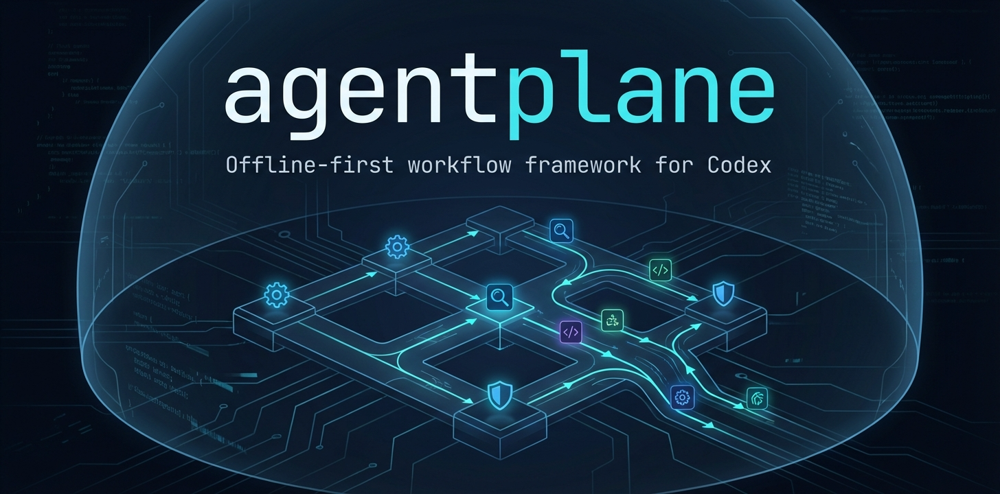

# agent/plane

[](https://www.npmjs.com/package/agentplane)
[](https://www.npmjs.com/package/agentplane)
[](LICENSE)
[](docs/user/prerequisites.mdx)
[](docs/developer/cli-contract.mdx)
[](ROADMAP.md)


**Agents you can actually trust in a repository.**

agent/plane (Agent Plane) is a policy-driven framework for running LLM agents inside real repositories. It turns "AI magic" into an engineering process: explicit approvals, role boundaries, and a reproducible execution pipeline. The goal is simple: make agents *boring, safe, and auditable*.

## 🚀 What is agent/plane?

Traditional AI coding agents may behave unpredictably, modify files without clear intent, or act outside expected boundaries. agent/plane changes that by introducing:

- **Policy-first execution** - every run follows a defined pipeline.
- **Approval & planning gates** - nothing runs without explicit consent.
- **Role-based workflows** - ORCHESTRATOR, PLANNER, CREATOR, INTEGRATOR, etc.
- **Safety guardrails by default** - actions outside the repo, network access, or unrestricted writes are disabled unless explicitly approved.
- **Support for team workflows** - including `direct` and `branch_pr` modes.

Agent behavior is not hidden: it's inspectable, reproducible, and constrained by policy.

## 📌 Key Principles

1. **Determinism over Magic**
   Agents follow a reproducible path:
   ```text
   Preflight → Plan → Approval → Tasks → Verify → Finish → Export
   ```

2. **Guardrails by Default**

   * Network and external actions require explicit approvals.
   * Writes are scoped to allow-listed paths.
   * Nothing can "just change files" without a plan and audit trail.

3. **Team-first workflows**
   `direct` mode is suitable for solo work;
   `branch_pr` enforces structured worktrees, single-writer flow, and an integrator role.

4. **Traceability**
   Task states, artifacts, and agents are documented and versioned: no hidden side effects.

## 🔧 Quickstart

Install the CLI (or use `npx`):

```sh
npm install -g agentplane
```

Initialize a repo:

```sh
npx agentplane init
```

See the CLI quickstart:

```sh
npx agentplane quickstart
```

**Note:** Full setup details, configuration options, and advanced workflows are in the docs (links below).

## 💡 Workflow Modes

### `direct` (default)

* Single-checkout mode.
* Agents and tasks run within the same working tree.
* Good for experiments and rapid iteration.

### `branch_pr`

* Structured team workflow.
* Each task flows through its own worktree + tracked PR artifacts.
* Only the *INTEGRATOR* role merges changes back into the main branch.

Use:

```sh
npx agentplane config set workflow_mode branch_pr
```

## 🧠 Core Concepts

### 🔹 AGENTS.md

This repository contains a special policy file (`AGENTS.md`) that defines:

* Global guardrails
* Allowed actions
* Agent roles and permissions
* Workflow defaults

It acts as the canonical policy layer (the "constitution") for agents.

### 🔹 Roles

Common roles include:

* **ORCHESTRATOR:** Drives the session and interprets user goals.
* **PLANNER:** Breaks goals into plan steps/tasks.
* **CREATOR:** Implements code/config changes.
* **INTEGRATOR:** Verifies and merges changes.
* **Additional roles** (e.g., TESTER, DOCS) can be defined per project.

## 📁 Project Structure

Your project with agent/plane typically includes:

```
AGENTS.md              # Policy & guardrails
.agentplane/           # Internal agent artifacts and config
.agentplane/tasks/     # Per-task records
.agentplane/config.json # agent/plane configuration
docs/                  # Full reference docs (see docs/index.mdx)
```

## 🛠 Safety and Security

agent/plane enforces:

* No external execution without explicit approval.
* No silent state changes.
* No unreviewed commits by agents.

This makes it suitable for **enterprise**, **team**, and **audit-sensitive** workflows.

## 📚 Documentation & Resources

The bulk of the guidance and API info lives in the docs:

* 🧭 **Full documentation:** `docs/index.mdx`
* 📌 **Workflow reference:** `docs/user/workflow.mdx`
* ⚙️ **CLI commands:** `docs/user/commands.mdx`
* 🧱 **Project layout:** `docs/developer/project-layout.mdx`
* 💡 **Examples & recipes:** `agentplane-recipes/README.md`

## 💬 Community & Contributing

Contributions are welcome. See `CONTRIBUTING.md` for guidelines and how to get involved.

## 📜 License

agent/plane is released under the MIT License.

> agent/plane is not about replacing developers - it's about giving developers **predictable, auditable, and controlled agent workflows** that scale with team and project complexity.
