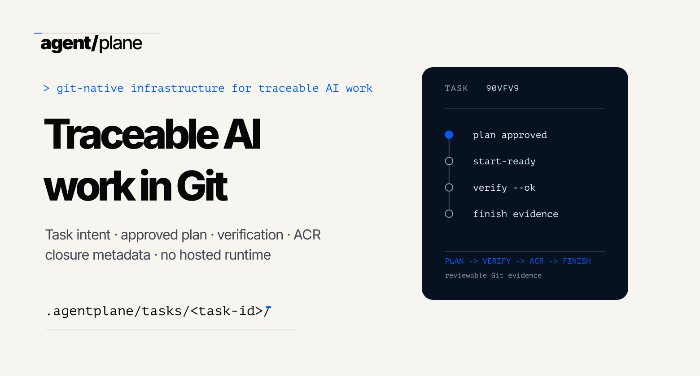

# AgentPlane

[](https://www.npmjs.com/package/agentplane)
[](https://www.npmjs.com/package/agentplane)
[](LICENSE)
[](docs/user/prerequisites.mdx)
[](docs/developer/cli-contract.mdx)

**Git-native control plane for auditable agent work.**

Put coding agents on a governed Git workflow.

AgentPlane is a local CLI for agent-driven development inside a git repository. It runs in your repo, not in a hosted runtime, and adds visible workflow artifacts such as `AGENTS.md` or `CLAUDE.md`, `.agentplane/`, task records, verification state, and deterministic closure. Teams trust it because approvals, task state, verification, and finish are explicit instead of implied. Use `agentplane` when you want agents to work inside a governed repository workflow rather than as an opaque assistant.

## What AgentPlane is

AgentPlane is a repository-native workflow layer for agent work.

It does not replace git, your editor, or your terminal. It sits inside an existing repository and gives agent execution a visible operating model:

- a policy gateway in the repo root
- a repo-local workspace in `.agentplane/`
- task state with ownership and dependencies
- verification and closure recorded in the repository
- workflow modes for both short loops and stricter team integration

## Why teams use it

Teams use AgentPlane when "just let the agent change files" is not enough.

- **Trust comes from visible state**. Approvals, task transitions, verification, and finish are all recorded in the repo.
- **The workflow stays local and inspectable**. There is no hosted control plane sitting between your repository and your team.
- **Agents work inside git, not around it**. Commits, review points, and closure remain explicit.
- **You can pick the right integration style**. Use `direct` for short loops or `branch_pr` for stricter handoff and integration.

## What appears in your repository

`agentplane init` adds a small set of visible artifacts so the workflow is legible to both humans and agents.

```text
AGENTS.md or CLAUDE.md   Policy gateway for the repository
.agentplane/            Repo-local workspace and workflow state
.agentplane/config.json Current repo configuration
.agentplane/tasks/      Per-task records
.agentplane/WORKFLOW.md Materialized workflow contract
.agentplane/tasks.json  Exported task snapshot derived from the current backend projection
```

These files matter because they make agent work inspectable. A reviewer can see what policy governs the repo, what task is active, what was verified, and how the task was closed.

## 2-minute quickstart

Install the CLI:

```bash
npm install -g agentplane
```

Initialize a repository:

```bash
agentplane init
agentplane quickstart
```

`agentplane init` creates the repo-local workflow surface: a policy gateway file (`AGENTS.md` or `CLAUDE.md`), `.agentplane/config.json`, built-in agent profiles, task storage, and workflow state files such as `.agentplane/WORKFLOW.md`.

The daily workflow starts with a task, not with a free-form prompt:

```bash
agentplane task new --title "First task" --description "Describe the change" --priority med --owner DOCS --tag docs
agentplane task plan set <task-id> --text "Explain the plan" --updated-by DOCS
agentplane task start-ready <task-id> --author DOCS --body "Start: ..."
agentplane task verify-show <task-id>
agentplane verify <task-id> --ok --by REVIEWER --note "Looks good"
agentplane finish <task-id> --author DOCS --body "Verified: ..." --result "One-line outcome" --commit <git-rev>
```

For the exact startup path and command semantics, use:

- [Overview](docs/user/overview.mdx)
- [Setup](docs/user/setup.mdx)
- [Commands](docs/user/commands.mdx)

## Workflow modes

AgentPlane supports two integration styles.

### `direct`

- single checkout
- short loops in the current working tree
- good for solo work and fast iteration

### `branch_pr`

- structured per-task branch or worktree flow
- explicit PR artifacts under `.agentplane/tasks/<task-id>/pr/`
- better fit when integration must stay separate from implementation

The difference is workflow discipline, not product tiering.

## Typical task flow

The normal happy path is short and explicit:

1. Run preflight and inspect the current repo state.
2. Create the task and record the plan.
3. Start the task with `agentplane task start-ready`.
4. Implement the change in the repository.
5. Print `Verify Steps` and record the result with `agentplane verify`.
6. Close the task with `agentplane finish`.

Under `direct`, `finish` creates the deterministic close commit by default. Under `branch_pr`, integration stays more structured and PR-oriented.

## When to use it

Use AgentPlane when:

- you want agents to work inside a real git repository
- you need explicit approvals, task state, verification, and closure
- you want repo-local artifacts that show what happened and why
- you need a governed workflow instead of a chat-style assistant loop

Do not use AgentPlane when:

- you are looking for a hosted agent platform
- you want a generic prompt framework
- you want the tool to hide git or replace your editor

## Documentation

Start here:

- [Overview](docs/user/overview.mdx)
- [Workflow](docs/user/workflow.mdx)
- [Commands](docs/user/commands.mdx)
- [Configuration](docs/user/configuration.mdx)
- [Backends](docs/user/backends.mdx)
- [CLI reference (generated)](docs/user/cli-reference.generated.mdx)

Developer and release docs:

- [Architecture](docs/developer/architecture.mdx)
- [CLI contract](docs/developer/cli-contract.mdx)
- [Release and publishing](docs/developer/release-and-publishing.mdx)
- [Release notes](docs/releases/)

If you need the deeper execution philosophy, keep it below the product surface:

- [Harness Engineering](docs/developer/harness-engeneering.mdx)

## Contributing

Contributions are welcome. See [CONTRIBUTING.md](CONTRIBUTING.md).

## License

MIT
