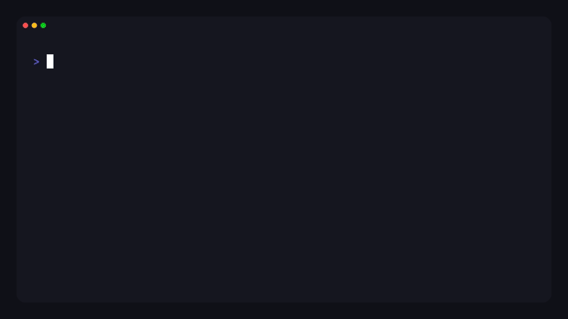

<p align="center">
  
</p>

# AgentPlane

**Git-native infrastructure for traceable AI work.**

AgentPlane turns Claude Code, Codex, Cursor, Aider, and other coding-agent changes into reviewable
Git evidence: task intent, approved plan, verification, finish state, and Agent Change Record.

```text
task -> plan -> approve -> implement -> verify -> finish
```

Not another agent. Not a hosted dashboard. The review trail for AI work, inside Git.

No hosted runtime. No telemetry. No vendor lock-in. Everything stays in your repository.

[](https://www.npmjs.com/package/agentplane)
[](https://www.npmjs.com/package/agentplane)
[](https://github.com/basilisk-labs/agentplane/stargazers)
[](LICENSE)
[](docs/user/prerequisites.mdx)

[](https://registry.npmjs.org/-/npm/v1/attestations/agentplane@latest)
[](https://docs.npmjs.com/generating-provenance-statements)
[](https://agentplane.org/docs/recipes)
[](https://github.com/basilisk-labs/agentplane/discussions)

## Install

```bash
npm i -g agentplane
agentplane init
agentplane quickstart
```

Requirements: Node.js 20+, Git, and a local terminal.



## Why

A pull request shows what changed. It does not reliably show what the agent was asked to do, which
plan constrained the change, which checks ran, or why the work is safe to merge.

AgentPlane records that missing evidence before it disappears into chat history, terminal
scrollback, or IDE state.

## What AgentPlane writes

`agentplane init` adds a local workflow surface:

```text
AGENTS.md                         Repository policy gateway
.agentplane/WORKFLOW.md           Workflow contract
.agentplane/tasks/<task-id>/       Task state and evidence
.agentplane/tasks/<task-id>/acr.json
                                  Agent Change Record
```

Reviewers do not need to trust an agent transcript. They can inspect files, commits, checks,
hashes, and the ACR.

## Agent Change Record

ACR is a commit-safe JSON record for AI-authored work. It captures task intent, approved plan, Git
commits, policy decisions, verification evidence, and merge readiness.

```bash
agentplane acr generate <task-id> --work-commit HEAD --write
agentplane acr validate <task-id> --mode local
agentplane acr check <task-id> --mode ci
agentplane acr explain <task-id>
```

Schema: [`schemas/acr-v0.1.schema.json`](schemas/acr-v0.1.schema.json).

## First task flow

Create a task:

```bash
agentplane task new --title "Fix parser edge case" --description "Reject empty labels." --owner <agent-id> --tag code
```

Record the plan and approval:

```bash
agentplane task plan set <task-id> --text "Add a fixture, tighten validation, and run focused tests." --updated-by <agent-id>
agentplane task plan approve <task-id> --by <reviewer-id>
```

Then start, verify, and finish:

```bash
agentplane task start-ready <task-id> --author <agent-id> --body "Start: implementing parser validation with focused tests."
agentplane task verify-show <task-id>
agentplane verify <task-id> --ok --by <agent-id> --note "Focused parser tests passed."
agentplane finish <task-id> --author <agent-id> --result "Parser rejects empty labels." --commit <git-rev>
```

Agent IDs are configurable profiles. See
[Agents](docs/user/agents.mdx).

## AgentPlane is not

- Not another coding agent.
- Not a prompt framework.
- Not a hosted dashboard.
- Not a replacement for Git, CI, or PR review.

It is the evidence layer around the tools you already use.

## Why AgentPlane

| Without AgentPlane       | With AgentPlane                       |
| ------------------------ | ------------------------------------- |
| Prompt in chat history   | Task intent recorded in the repo      |
| Plan is implicit         | Plan is explicit and can be approved  |
| Verification is a claim  | Verification is recorded with context |
| Reviewer reads one diff  | Reviewer reads diff plus task record  |
| Closure is manual        | Finish state links to a commit        |
| Workflow lives elsewhere | Workflow artifacts live in Git        |

## vs. other tools

AgentPlane is not another coding agent. It is the workflow envelope around the agent you already
use:

- Claude Code, Codex, Cursor, and Aider generate or edit code; AgentPlane records the task trail.
- `AGENTS.md` and `CLAUDE.md` are policy text; AgentPlane adds task state and CLI gates around it.
- Git stores the final diff; AgentPlane stores the task, plan, verification, and closure evidence
  beside that diff.
- Hosted agent dashboards centralize workflow state; AgentPlane keeps it local to the repository.

See the full comparison page in [docs/compare.mdx](docs/compare.mdx).

## Recipes

Recipes are optional signed behavior modules. Start with the task -> plan -> verify -> ACR flow
first; add recipes only when you need reusable agent profiles, prompt modules, skills, scenario
assets, or repository mapping.

```bash
agentplane recipes list-remote
agentplane recipes install code-map --refresh --yes
```

The current catalog starts with [Code Map](docs/recipes/code-map.mdx).

## Who uses it

- Solo developers who want future-you to know why an agent changed 19 files.
- OSS maintainers who require agent-generated PRs to include task intent, plan, checks, and ACR.
- Engineering teams that make agent work follow a shared lifecycle before review.
- Platform and security teams that need local, inspectable, policy-aware, CI-gateable AI work.

DCO sign-off and multi-author commits are first-class. AgentPlane-managed commits preserve DCO
identity fallbacks so agent and human co-authoring stays compliant.

Using AgentPlane in a real repo? Tell us in
[Discussions](https://github.com/basilisk-labs/agentplane/discussions). We will add your story to
[docs/showcase](docs/showcase.mdx).

## Workflow modes

### `direct`

Fast local loops in the current checkout. Use it for solo work, prototypes, and short tasks.

### `branch_pr`

Per-task branches, worktrees, PR artifacts, and integration handoff. Use it for teams and stricter
review boundaries.

## Workflow guides

- [AgentPlane + Claude Code](docs/workflow-guides/claude-code.mdx)
- [AgentPlane + Codex](docs/workflow-guides/codex.mdx)
- [AgentPlane + Cursor](docs/workflow-guides/cursor.mdx)
- [AgentPlane + Aider](docs/workflow-guides/aider.mdx)
- [AgentPlane + GitHub Actions](docs/workflow-guides/github-actions.mdx)
- [AgentPlane + branch_pr workflow](docs/workflow-guides/branch-pr.mdx)

## Documentation

- [Overview](docs/user/overview.mdx)
- [Setup](docs/user/setup.mdx)
- [Workflow](docs/user/workflow.mdx)
- [Task lifecycle](docs/user/task-lifecycle.mdx)
- [Commands](docs/user/commands.mdx)
- [CLI reference](docs/user/cli-reference.generated.mdx)
- [Architecture](docs/developer/architecture.mdx)
- [CLI contract](docs/developer/cli-contract.mdx)

## Status

[](https://github.com/basilisk-labs/agentplane/actions/workflows/ci.yml)
[](https://github.com/basilisk-labs/agentplane/actions/workflows/ci.yml)
[](https://github.com/basilisk-labs/agentplane/actions/workflows/ci.yml)
[](https://github.com/basilisk-labs/agentplane/actions/workflows/ci.yml)
[](docs/developer/cli-contract.mdx)

## Contributing

Contributions are welcome. See [CONTRIBUTING.md](CONTRIBUTING.md).

## Help us ship this

If AgentPlane saved you a bad merge, [star the repo](https://github.com/basilisk-labs/agentplane)
and drop a note in [Discussions](https://github.com/basilisk-labs/agentplane/discussions). It is
the only growth signal we use.

## Stargazers over time

[](https://star-history.com/#basilisk-labs/agentplane&Date)

## License

MIT
