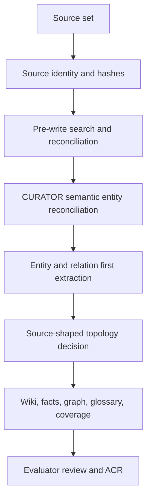
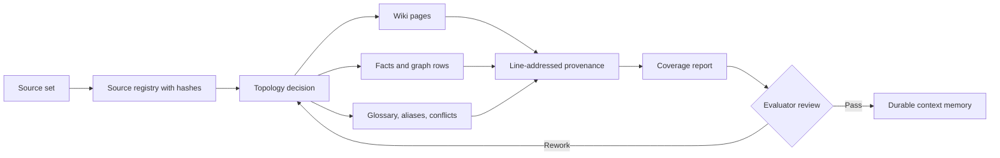

# Choose a context mode

Agentplane exposes one public context ingestion mode: `maximum-assimilation`. Older profile names
such as `adaptive`, `minimal`, `wiki`, `codebase`, and `research` are compatibility aliases only;
context ingest still creates a `context.maximum_assimilation` task.

## Public contract

Use `maximum-assimilation` when context should become durable project memory. The mode asks the
CURATOR task to preserve source meaning through wiki pages, fact/claim rows, graph rows, glossary
entries, provenance, coverage, and evaluator review.

The mode does not force every project into the same folder taxonomy. The required lifecycle and
validators stay fixed, while the wiki topology remains source-shaped and must be justified by source
evidence.

Agentplane does not decide semantic identity in deterministic CLI code. Every ingest creates a
formal CURATOR task with a source lock, addressable spans, a complete canonical entity catalog,
the extraction schema, stop rules, expected artifacts, and verification commands. The CURATOR
compares meaning and records the decision; Agentplane validates and applies the selected canonical
identifier.

## Ingestion flow



## Default

`maximum-assimilation` is the default for `agentplane context init`.

```bash
agentplane context init
```

Passing an old profile name is accepted for compatibility, but context ingest still produces a
maximum-assimilation task.

```bash
agentplane context init --profile adaptive
```

## Migrate existing context workspaces

Existing context repositories can be moved onto the v2 artifact contract without rewriting their
legacy knowledge layer:

```bash
agentplane context migrate maximum-assimilation-v2 --dry-run
agentplane context migrate maximum-assimilation-v2
```

The migration preserves `context/wiki/**`, facts, and graph rows. It creates missing topology,
page-manifest, page-creation, and entity-resolution artifacts from existing wiki paths and graph
entities. Existing raw-source span coverage remains legacy/unresolved until the workspace is
re-verified under strict maximum-assimilation v2.

Maximum-assimilation is especially useful when:

- the source is a corpus, specification, book, research folder, product archive, or large task
  history;
- the agent must choose a source-shaped wiki topology before writing pages;
- the review needs explicit coverage, conflicts, aliases, and redactions;
- raw material may not be convenient to keep in the working set forever.

### Maximum assimilation flow



## Stop rules

- Do not put secrets or private credentials into context.
- Do not create a page family before the source evidence justifies that topology.
- Do not normalize ambiguous names into one entity; keep aliases, conflicts, or open questions.
- Do not treat equal stable IDs, similar spelling, or lexical search rank as semantic proof. Compare
  kind, scope, validity, ownership, defining properties, provenance, and graph neighborhood.
- Do not delete raw sources until coverage and raw-deletion resilience have been reviewed.

## Agent handoff

Point the agent at [Agent guide](agent-guide) and require:

- source registry with hashes;
- complete canonical entity catalog and evidence-bearing resolution rows;
- topology decision;
- glossary and alias review;
- line-addressed provenance;
- coverage report;
- evaluator review before finish.
