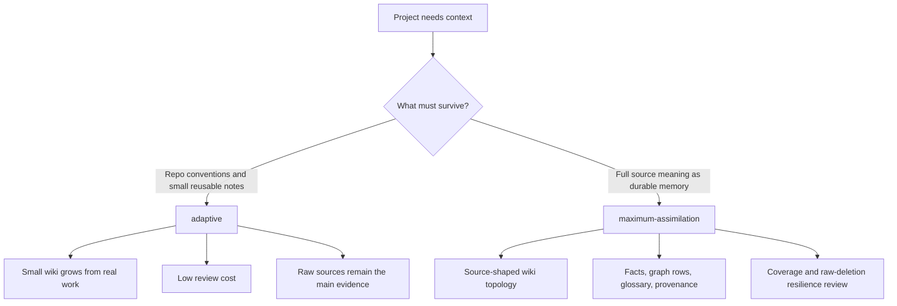
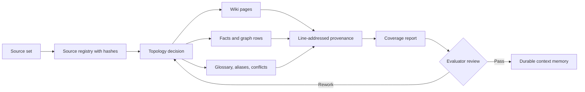

# Choose a context mode

Context mode controls how aggressively Agentplane asks agents to turn sources into durable project
knowledge.

## Quick choice

| Need                                                                                       | Use                    |
| ------------------------------------------------------------------------------------------ | ---------------------- |
| Quick repo grounding for normal agent work                                                 | `adaptive`             |
| A small wiki that grows as work happens                                                    | `adaptive`             |
| Low review cost                                                                            | `adaptive`             |
| A durable semantic memory from a corpus, spec, book, or large notes set                    | `maximum-assimilation` |
| Coverage reports, glossary discipline, and raw-deletion resilience                         | `maximum-assimilation` |
| A project knowledge base that should be useful even when raw sources are later unavailable | `maximum-assimilation` |

## Mode selection flow



## Default

`maximum-assimilation` is the default for `agentplane context init`.

```bash
agentplane context init
```

Use the default when the context layer should become durable project memory. It creates the same
editable context workspace as smaller profiles, but asks future context-ingestion work to preserve
source meaning through wiki pages, facts, graph rows, glossary entries, provenance, and coverage.

## Adaptive

Choose `adaptive` explicitly when review cost matters more than exhaustive assimilation.

```bash
agentplane context init --profile adaptive
```

Use it for ordinary software repositories that only need reusable conventions and a small wiki that
grows as work happens. It creates a stable context contract and lets the wiki structure grow from
actual sources. Agents should keep the smallest useful structure, cite sources, and avoid duplicating
concepts.

Adaptive mode is best when:

- the project mainly needs reusable repo conventions;
- sources arrive gradually;
- context changes should stay small and cheap to review;
- raw sources remain available as evidence.

## Maximum assimilation

`maximum-assimilation` is for turning a source set into durable semantic memory.

```bash
agentplane context init --profile maximum-assimilation
```

Use it when the next ingestion tasks should preserve all significant source meaning in wiki pages,
facts, graph rows, glossary entries, provenance, and coverage reports. The result should remain
understandable even if raw sources are later moved, private, or deleted.

Maximum-assimilation mode is best when:

- the source is a corpus, specification, book, research folder, product archive, or large task
  history;
- the agent must choose a source-shaped wiki topology before writing pages;
- the review needs explicit coverage, conflicts, aliases, and redactions;
- raw material may not be convenient to keep in the working set forever.

### Maximum assimilation flow



## Stop rules

- Do not put secrets or private credentials into context.
- Do not use maximum assimilation for one-off notes.
- Do not create a page family before the source evidence justifies that topology.
- Do not normalize ambiguous names into one entity; keep aliases, conflicts, or open questions.
- Do not delete raw sources until coverage and raw-deletion resilience have been reviewed.

## Agent handoff

For adaptive tasks, point the agent at [Agent guide](agent-guide).

For maximum assimilation, also require:

- source registry with hashes;
- topology decision;
- glossary and alias review;
- line-addressed provenance;
- coverage report;
- evaluator review before finish.
