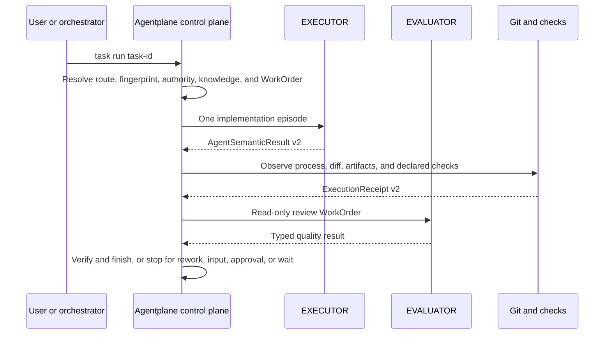
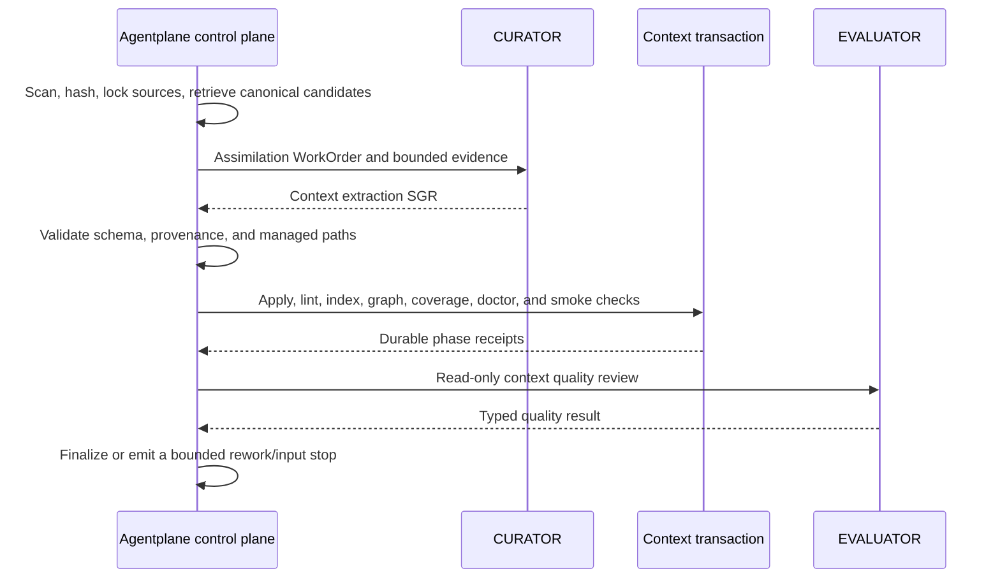
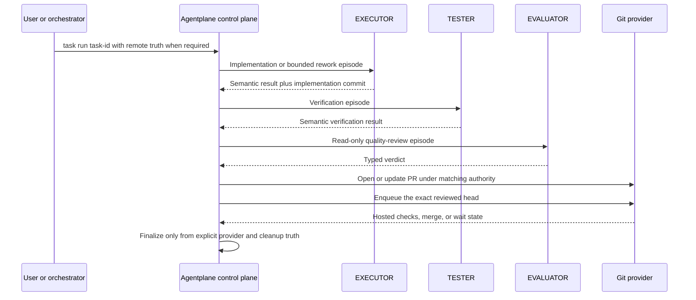

## What runs where

Agent Plane has three layers with different responsibilities:

1. CLI runtime (`packages/agentplane/src`)
2. Shared models and config (`packages/core/src`)
3. Generated schema/spec layer (`schemas` and `packages/spec/schemas`)

The runtime layer owns command behavior. The core layer owns parsing, defaults, validators, and shared contracts. The root `schemas/` directory is the repository discovery surface for generated public schemas. The spec layer is a generated mirror for tooling and external consumers, synchronized from runtime code into `schemas`, `packages/spec/schemas`, and `packages/core/schemas`.

Durable config and task artifact contracts now use Zod in `packages/core/src/**` as the single source of truth, with generated JSON Schema mirrors emitted for tooling and external consumers.

For the architectural decision and practical boundary guidance, see [ADR: Zod Contract SSOT](../adr/zod-contract-ssot) and [Schema validation strategy](schema-validation-strategy).

## Current priority

This page describes the Agentplane 0.7 architecture. The release goal is a mechanically
authoritative, semantically blind CLI: deterministic facts and lifecycle mechanics move out of
agent reasoning, while interpretation, design, implementation, synthesis, and quality judgment stay
with specialized semantic roles.

The rule is narrower than "automate everything." A step belongs in the CLI control plane only when
its inputs and outputs are typed, its preconditions are mechanically decidable, its outcome can be
independently observed, and its side effects are bounded by policy and current authority. Otherwise
the route emits an agent episode, approval, human-input request, wait, or terminal result.

## Agentplane 0.7 plane model

| Plane     | Owns                                                                                                                                                | Must not own                                                                     |
| --------- | --------------------------------------------------------------------------------------------------------------------------------------------------- | -------------------------------------------------------------------------------- |
| Knowledge | Repo-owned sources, wiki, facts, graph, glossary, provenance, and rebuildable retrieval projections.                                                | Per-run semantic decisions or a second hidden knowledge base.                    |
| Control   | Task/project/Git/provider truth, typed route steps, state fingerprints, authority, process supervision, deterministic operations, and transactions. | Architecture choices, prose interpretation, implementation, or quality verdicts. |
| Semantic  | One bounded PLANNER, CURATOR, EXECUTOR, or EVALUATOR responsibility per episode.                                                                    | Direct lifecycle mutation or claims of observed process/Git/check truth.         |
| Evidence  | Supervisor-observed process, Git, filesystem, artifact, check, effect, and provider receipts.                                                       | Promotion of agent-reported claims without observation.                          |

The stable loop is:

```text
CLI prepares facts and candidates
  -> one semantic role interprets or creates
  -> CLI validates schema, provenance, state, and authority
  -> CLI applies an allowed result and independently observes the outcome
```

This extends the existing context extraction pattern to task execution and evaluation instead of
creating a second context system.

## Versioned semantic boundary

| Contract              | Version | Responsibility                                                                                                                 |
| --------------------- | ------: | ------------------------------------------------------------------------------------------------------------------------------ |
| `StateFingerprint`    |       1 | Binds a prepared step to current task, Git, checkout, provider, policy, and related state.                                     |
| `KnowledgeRef`        |       1 | Digest-addressed reference into the existing context plane plus retrieval provenance.                                          |
| `AgentWorkOrder`      |       2 | One role, objective, task revision, authority, bounded evidence, required inputs/outputs, verification intent, and stop rules. |
| `AgentSemanticResult` |       2 | Semantic status, summary, findings, uncertainty, blocker, bounded knowledge request, and claimed checks.                       |
| `ExecutionReceipt`    |       2 | Agentplane-observed process, Git, artifact, filesystem scope, checks, cleanup, and success-policy evidence.                    |
| `WorkflowStep`        |       1 | One `cli_operation`, `agent_episode`, `approval`, `human_input`, `wait`, or `terminal` decision.                               |

The generated schemas under `schemas/` are the public contract truth. New agent invocation requires
`AgentWorkOrder` v2. Historical WorkOrder v1 has deterministic compatibility conversion;
historical `ExecutionReceipt` v1 remains readable, while new receipts use v2.

`claimed_checks` in `AgentSemanticResult` are deliberately not `checks` in `ExecutionReceipt`. The
former records what an agent says; the latter records what the supervisor observed.

## Supervised flows

### Direct task



The EXECUTOR lifecycle event delta must remain zero: the agent edits the approved workspace and
returns semantic output; the supervisor owns start, observed checks, verification recording, and
eligible finish operations.

### Context assimilation



Completed mechanical phases are journaled. After a crash or deterministic failure, resume repeats
only the failed phase and does not replay the CURATOR result or already completed effects.

### branch_pr task



The supervisor does not imitate plan approval, provider merge, or another external side effect. A
missing authority becomes a typed approval step. A pending check or integration queue becomes a
typed wait. Merge-conflict or stale-head repair becomes a separate semantic rework episode.

## Authority and effect safety

Every protected side effect is bound to an operation digest, a current `StateFingerprint`, a state
scope digest, an actor, a policy rule, and an expiry. A matching record authorizes only that
operation under that state. A changed task revision, Git head, provider state, or policy scope makes
the prepared operation stale.

The supervisor persists effect intent before execution. An interrupted effect is not blindly
retried: it remains `effect_in_doubt` until reconciled from external evidence. This applies to PR,
integration, release, and other side-effecting routes as well as process ownership.

Phase-scoped run tools use a signed run/work-order capability. Global command visibility is an
operator UX surface, not the security boundary.

## Knowledge and retrieval boundary

The context plane remains the durable LLM-wiki under `context/**`. Work orders carry `KnowledgeRef`
records and bounded prepared excerpts, with an included, omitted, missing, or stale receipt for each
declared reference. FTS5/BM25 search, aliases, graph expansion, freshness checks, and deterministic
candidate construction happen before the episode. Low-confidence gaps can produce one bounded
`KnowledgeRequest`; they do not grant the agent unrestricted discovery or create another wiki.

Post-task learning produces source-backed proposals. CURATOR review remains the promotion boundary,
so a successful task does not automatically contaminate canonical project knowledge.

## Application and rendering boundary

Commands declare granular `CommandSession` capabilities. A command that asks only for project or
task-read state cannot silently resolve provider, network, task-write, Git-write, or artifact-write
capabilities. Use cases return typed results; human, plain, JSON, and error renderers own stdout and
stderr compatibility. Supervisor code calls use cases rather than parsing CLI output.

Architecture checks enforce these boundaries with zero active dependency violations. Command-family
migration was delivered in vertical slices rather than a big-bang rewrite.

## Performance policy

Preparation traces record node inputs, dependencies, bytes, invalidation causes, and cacheability.
Semantic, authority, provider, and mutable repository truth remain non-cacheable. Persistent and
command-local preparation-cache candidates were removed after safe variants failed the required
five-percent end-to-end threshold; the architecture retains measurements instead of unjustified
state.

Cost is evaluated per verified result. A token or latency reduction never offsets a safety,
observed-success, or evidence-provenance regression.

## Framework control plane

The framework layer is the reusable control plane that recipes and runner-specific code now consume instead of rebuilding local helper state.

- Harness resolution:
  - `packages/agentplane/src/runtime/harness/*`
  - Produces `ResolvedHarnessContract` from repo policy gateway, config, workflow mode, task contract, backend restrictions, and protected-path rules.
- Canonical execution context:
  - `packages/agentplane/src/runtime/execution-context.ts`
  - Produces `AgentplaneExecutionContext` / `ReadOnlyUsecaseContext` with repo, task backend, harness, approvals, capability registry, execution-profile runtime, task-intake runtime, explain payloads, and protocol surfaces.
- Behavior precedence and traces:
  - `packages/agentplane/src/runtime/behavior/*`
  - Formal precedence is `harness -> extension -> user -> builtin`, with traceable winners and conflicts.
- Capabilities:
  - `packages/agentplane/src/runtime/capabilities/*`
  - Unifies backend- and runner-facing capability projection, including unavailable/blocked semantics.
- Governance runtime:
  - `packages/agentplane/src/policy/*`
  - `packages/agentplane/src/runtime/approvals/*`
  - `packages/agentplane/src/runtime/execution-profile/*`
  - Makes approvals, risky actions, budgets, stop/handoff conditions, trace policy, and timeout policy explicit runtime inputs.
- Task intake:
  - `packages/agentplane/src/runtime/task-intake/*`
  - Defines `TaskIntakeContext`, clarification contracts, graph drafts, and materialization plans without binding them to a specific recipe or runner adapter.
- Explain and protocol:
  - `packages/agentplane/src/runtime/explain/*`
  - `packages/agentplane/src/runtime/protocol/*`
  - Produces machine-readable explain payloads plus additive, versioned protocol/result envelopes that can be persisted and extended without replacing the core model.

## CLI runtime map

- Command entry and global argument handling:
  - `packages/agentplane/src/cli/run-cli.ts`
- Command registry and lazy loading:
  - `packages/agentplane/src/cli/run-cli/command-catalog.ts`
- Command handlers:
  - `packages/agentplane/src/commands/**`
- Shared module topology:
  - [Module topology](module-topology)
- Task backend integration:
  - `packages/agentplane/src/backends/task-backend/load.ts`
- Built-in task backends:
  - `packages/agentplane/src/backends/task-backend/local-backend.ts`
  - `packages/agentplane/src/backends/task-backend/cloud-backend.ts`
- Cloud connector integration:
  - Provider-specific sync adapters, including Redmine, live outside the public CLI behind the cloud backend contract.

## Core map

- Project resolution:
  - `packages/core/src/project/`
- Config parsing and defaults:
  - `packages/core/src/config/`
- Task document and snapshot primitives:
  - `packages/core/src/tasks/`

## Runtime data flow

1. CLI resolves project root, runtime mode, and `.agentplane/WORKFLOW.md`.
2. `runtime/harness` resolves the repo-level contract into `ResolvedHarnessContract`.
3. `runtime/execution-context.ts` assembles the canonical execution context around that harness.
4. Behavior, capability, approval, execution-profile, task-intake, explain, and protocol modules derive reusable runtime inputs from the canonical context.
5. Command handlers and runner usecases consume the same context instead of rebuilding ad hoc task/repo/config helpers.
6. Backend mutation and task projection update `.agentplane/tasks/<task-id>/README.md` and optional generated export snapshots.
7. Shared runner flows persist production run artifacts under
   `<git-common-dir>/agentplane/runner/tasks/<task-id>/runs/<run-id>/`, including machine-readable
   framework explain/protocol payloads in the bundle. The supervisor-owned root is stable across
   linked worktrees and protected from native Codex `read-only` and `workspace-write` sandboxes.
   `danger-full-access` and host-authority custom or Hermes runners can address that root, so their
   filesystem authority remains unverified. Reads through public runner usecases retain a narrow
   compatibility path for historical 0.6.24 task-local run artifacts; new run creation never uses
   that legacy location. Cancelling a prepared legacy run may update its existing state and events,
   but a running legacy run is never signaled or synthesized as terminal because its supervisor
   does not participate in the cooperative cancellation protocol. Unsafe, invalid, or incomplete
   supervisor paths fail closed instead of falling back.
   Per-task execution claims serialize provider authority inside one repository instance. A stale
   claim is recovered only under a generation-scoped exclusive recovery lease and only when the
   claimed run is absent, terminal, or incomplete before provider spawn. Active or unverified
   owners, ambiguous non-terminal runs, and existing or invalid recovery leases remain fail-closed;
   a recovery lease is never stolen based on age or apparent owner death. Terminal supervisor state
   is projected to TaskData before the claim is retired; non-local projections use the backend's
   revision guard. A terminal claim remains non-recoverable when process cleanup is failed, unknown,
   or reports a live residual; supervisor-owner death alone cannot bypass that process boundary.
   Confirmed cleanup retires authority for the declared managed scope even when descendant
   containment remains limited; this avoids wedging every current POSIX and Windows run while
   keeping failed, unknown, and residual cleanup fail-closed. Direct-child cleanup therefore records
   process-group and descendant-lifetime checks as `not_run`, not failed. Limited process lifetime
   keeps workspace-write and host-authority success policies unverified with an explicit residual
   risk. Only an exact inherited native read-only boundary with no writable scope may establish
   overall observed success through filesystem-effect containment, without upgrading the separate
   process-lifetime claim. The currently claimed run is authoritative across runs even if the wall
   clock moves backwards, while same-run lifecycle rank prevents a terminal state from regressing
   to `running` or `prepared`. Without current-claim authority, `created_at` keeps delayed historical
   projection from replacing a newer run.
   Atomic TaskData and runner control-file publications fsync file contents and, where the operating
   system and filesystem support it, the parent directory. Unsupported directory fsync is
   best-effort, so the contract does not claim universal power-loss durability. Pure Node does not
   expose `openat`/`linkat`: path ancestry and inode changes are checked before and after operations,
   but a hostile same-user swap inside the syscall-sized check/use gap remains a platform
   limitation. Cross-clone execution coordination is likewise outside the repository-local claim
   contract.
8. Agent Change Record support derives `.agentplane/tasks/<task-id>/acr.json` from the same task,
   policy, verification, finish, and Git evidence instead of adding a parallel task source of truth.

## Task file decision

Current target:

1. Keep one file per task.
2. Keep `.agentplane/tasks/<task-id>/README.md` as the canonical container for now.
3. Treat frontmatter as the canonical task state, including `revision`, `sections`, status, and lifecycle metadata.
4. Treat the visible markdown body as a generated projection, not as the operational write surface.

Why README stays the target for now:

1. It preserves the current human-first workflow: one readable task file, stable diffs, and no split between structured state and narrative view.
2. Canonical frontmatter already gives the system the structured write surface it needed for generated body, migration, and revision groundwork.
3. Moving to single-file YAML now would impose migration and tooling cost without solving a correctness problem that the current README-plus-frontmatter model still has.

Revisit a future `task.yaml` target only if at least one of these becomes true:

1. Frontmatter grows large enough that task files become materially harder to scan than the generated body helps.
2. Most task mutations become machine-driven and the rendered markdown view stops being the primary human surface.
3. Non-local backends or external integrations need a stricter structured payload than YAML frontmatter inside README can express cleanly.
4. Projection repair, normalization, or container-specific drift starts costing more complexity than a format migration would remove.

## Harness engineering loop

Agent Plane architecture is designed for an iterative control loop:

1. **Constrain**: define scope and policy via contracts/config.
2. **Execute**: run small, explicit command steps.
3. **Observe**: capture structured artifacts and diagnostics.
4. **Recover**: use deterministic fallback/restore paths.
5. **Integrate**: merge verified increments quickly.

This loop keeps autonomy useful while preserving operator control and repository legibility.

## Upgrade and policy flow

`agentplane upgrade` applies managed framework assets and can emit plan-only upgrade artifacts.

- In agent mode, run artifacts are created under `.agentplane/.upgrade/agent/<runId>/` only when a plan-only report is needed (changes to add/update).
- When there are no managed changes, agent mode exits via fast no-op and does not create per-run artifacts.
- Auto mode uses replace-first behavior for managed files; `.agentplane/policy/incidents.md` is append-only when local content already exists.

Policy enforcement now resolves through the framework layer and is then consumed by command handlers, runner flows, and guard paths:

- `ResolvedHarnessContract` defines workflow, task, policy, and backend restrictions.
- `PolicyEngine` classifies actions and `ApprovalRuntime` evaluates gated behavior such as network, fs, git, config, and force mutations.
- `ResolvedExecutionProfileRuntime` carries approval escalation, budgets, stop/handoff conditions, trace policy, and timeout policy.
- Runner and recipe-adjacent flows receive the same resolved policy inputs through the canonical context and persisted runner bundle.

The existence of these shared surfaces should not be read as an active mandate to broaden runner or
recipe architecture without a scoped task and verification plan.

## Release flow

Release is split into planning and apply:

1. `agentplane release plan` generates patch candidate and notes inputs.
2. `agentplane release apply` updates versions and changelog artifacts.
3. Local prepublish gates must pass before `--push`.
4. npm publish is GitHub-only with provenance enforced by package scripts and workflow checks.

## Related docs

- [Migrate to Agentplane 0.7](../user/v0-7-migration)
- [Project layout](project-layout)
- [Module topology](module-topology)
- [CLI contract](cli-contract)
- [Release and publishing](release-and-publishing)
- [Tasks and backends](../user/tasks-and-backends)
- [ACR implementation plan](agent-change-record-implementation)
