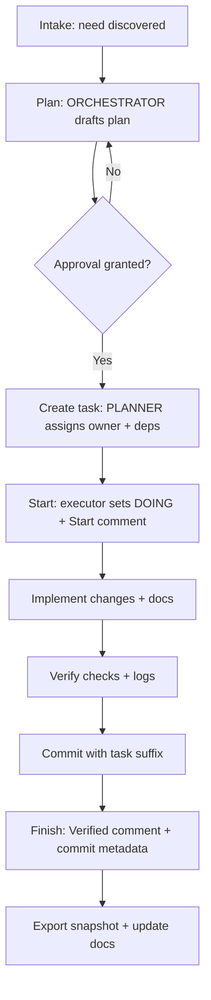
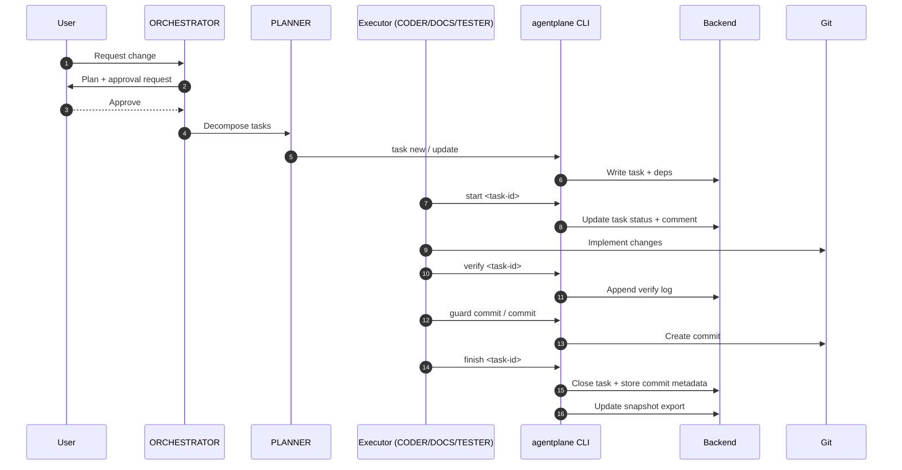
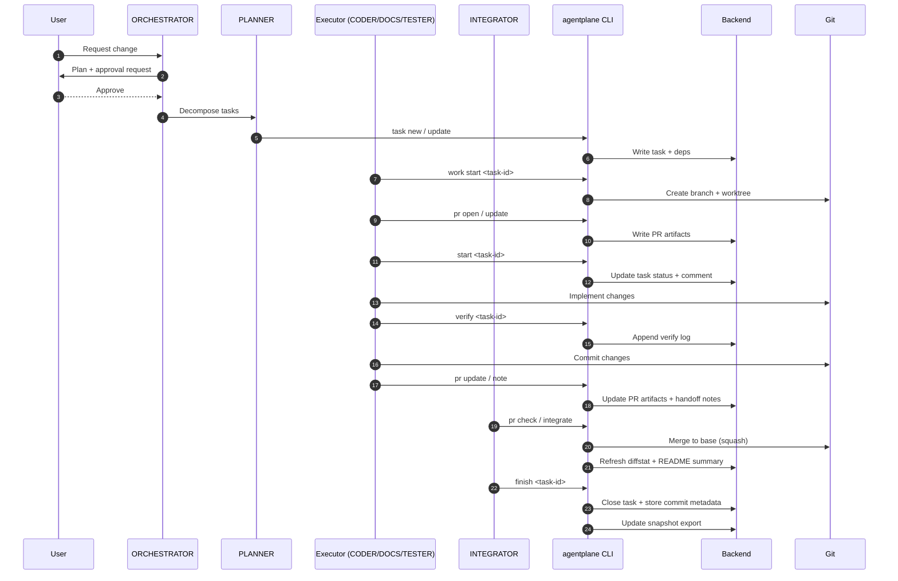

## Overview

A task moves through the same core stages in both modes:

1. **Intake**: a need is identified and recorded.
2. **Plan**: ORCHESTRATOR drafts a plan and requests approval.
3. **Create**: PLANNER creates the task, assigns ownership, and sets dependencies.
4. **Start**: the executor marks the task DOING with a structured comment.
5. **Implement**: code, docs, and artifacts are produced.
6. **Verify**: required checks run and logs are stored.
7. **Commit**: changes are committed with the task ID suffix.
8. **Finish**: the task is closed with a Verified note and commit metadata.
9. **Export**: task snapshots are updated for integrations.

The differences between modes are about **where** work happens and **who** performs closure.

## Lifecycle flow (all modes)

## direct mode (single checkout)

**Where work happens:** in the current checkout.

**Who closes the task:** the executor (often CODER/DOCS/TESTER) after the implementation commit.

**Key artifacts:**

- Task README and status updates are written directly in the repo.
- Verify logs live under the task artifact directory.
- Optional PR artifacts are allowed but not required.

### Sequence diagram (direct)

## branch_pr mode (task branches + worktrees)

**Where work happens:** in a per-task branch/worktree.

**Who closes the task:** INTEGRATOR on the base branch after merge.

**Key artifacts:**

- PR artifacts are required under `.agentplane/tasks/<task-id>/pr/`.
- Canonical task writes happen on the base branch only.
- Handoff notes are appended during review and carried into closure.

### Sequence diagram (branch_pr)

## Lifecycle notes and guardrails

- **Approvals**: plan and network approvals are enforced via config (`agents.approvals.*`).
- **Status comments**: start/block/finish require structured text (Start/Blocked/Verified).
- **Commit policy**: commit subjects must include the task ID suffix.
- **Docs updates**: task README sections are updated via `agentplane task doc set`.
- **Exports**: task snapshots are updated only via `agentplane` commands.

## Related docs

- [Workflow](workflow)
- [Branching and PR artifacts](branching-and-pr-artifacts)
- [Tasks and backends](tasks-and-backends)
- [Configuration](configuration)
