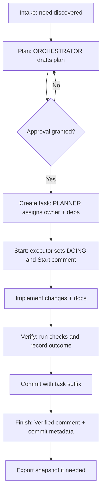
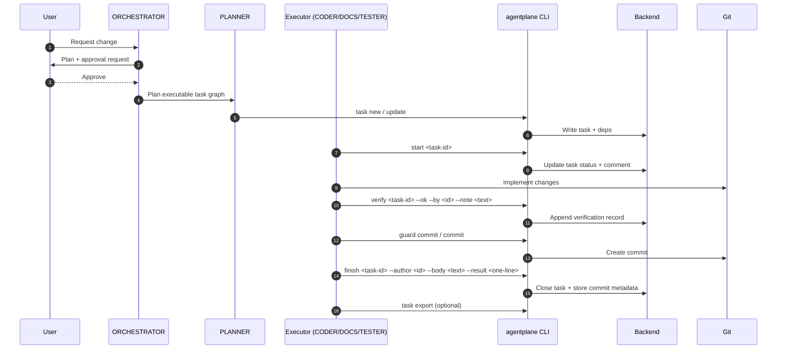
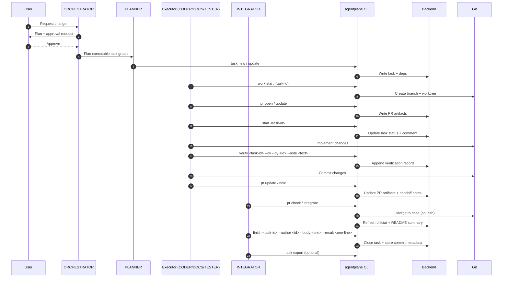

## Overview

A task moves through the same core stages in both modes:

1. **Intake**: a need is identified and recorded.
2. **Plan**: ORCHESTRATOR drafts a plan and requests approval.
3. **Create**: PLANNER creates the task, assigns ownership, and sets dependencies.
4. **Start**: the executor marks the task DOING with a structured comment.
5. **Implement**: code, docs, and artifacts are produced.
6. **Verify**: checks are run (if configured) and a verification outcome is recorded.
7. **Commit**: changes are committed with the task ID suffix.
8. **Finish**: the task is closed with a Verified note and commit metadata.
9. **Export (optional)**: export a task snapshot for integrations (for example `agentplane task export`).

Task creation targets executable work only.
Task graph planning splits work into atomic tasks, each assigned to one specific owner.

The differences between modes are about **where** work happens and **who** performs closure.

## Lifecycle flow

## direct mode (single checkout)

**Where work happens:** in the current checkout.

**Who closes the task:** the executor (often CODER/DOCS/TESTER) after the implementation commit.

**Key outputs:**

- Task README and status updates are written directly in the repo.
- Verification records are appended to the task README under `## Verification` via `agentplane verify ...`.
- PR artifacts are optional in this mode.

### Sequence diagram (direct)

## branch_pr mode

**Where work happens:** in a per-task branch/worktree.

**Who closes the task:** INTEGRATOR on the base branch after merge.

**Key outputs:**

- PR artifacts are required under `.agentplane/tasks/<task-id>/pr/`.
- Canonical task writes happen on the base branch only.
- Handoff notes are appended during review and carried into closure.

### Sequence diagram (branch_pr)

## Guardrails and policies

- **Approvals**: plan, network, and verification approvals are enforced via config (`agents.approvals.*`).
- **Preflight depth**:
  - `agentplane preflight` uses quick mode by default (fast, no backend task-list probe).
  - `agentplane preflight --mode full` adds backend task-list readiness checks.
- **Status comments**: start/block/finish require structured text (Start/Blocked/Verified).
- **Allowed status transitions**:
  - `TODO -> DOING|BLOCKED`
  - `DOING -> DONE|BLOCKED`
  - `BLOCKED -> TODO|DOING`
- **Status-commit major transitions**:
  - `TODO -> DOING`
  - `DOING -> BLOCKED`
  - `BLOCKED -> DOING`
  - `DOING -> DONE`
- **Two-stage verification**:
  - `## Verify Steps` is the ex-ante verification contract (criteria/protocol addressed to the verifier).
  - `## Verification` is the ex-post append-only record written by `agentplane verify ...`.
- **Primary-tag verification policy**:
  - Verify-step and verification requirements are controlled by `tasks.verify.require_steps_for_primary` and `tasks.verify.require_verification_for_primary`.
- **branch_pr verify logs**: `agentplane integrate --run-verify` executes frontmatter `verify:` commands and appends output to `.agentplane/tasks/<task-id>/pr/verify.log`.
- **Back-compat**: frontmatter `verify: string[]` remains supported as optional suggested commands; it is not required by the two-stage model.
- **Commit policy**: commit subjects must include the task ID suffix.
- **Duplicate closure shortcut**: for accidental duplicate tasks, use one command:
  - `agentplane task close-duplicate <task-id> --of <canonical-task-id> --author <ROLE>`
- **Preferred close flow (single command)**:
  - `agentplane finish <task-id> --author <ROLE> --body "Verified: ..." --commit <git-rev> --close-commit` closes task metadata and creates the deterministic close commit in one step.
  - Add `--close-unstage-others` when unrelated staged files are present.
- **Legacy/manual close command**:
  - `agentplane commit <task-id> --close --check-only` shows the generated close subject without creating a commit.
  - `agentplane commit <task-id> --close --unstage-others` auto-unstages unrelated index entries before creating the deterministic close commit.
- **Docs updates**: task README sections are updated via `agentplane task doc set`.
- **Exports**: task snapshots are updated only via `agentplane` commands.

## Related docs

- [Workflow](workflow)
- [Branching and PR artifacts](branching-and-pr-artifacts)
- [Tasks and backends](tasks-and-backends)
- [Configuration](configuration)
