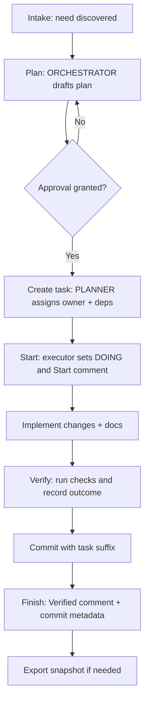
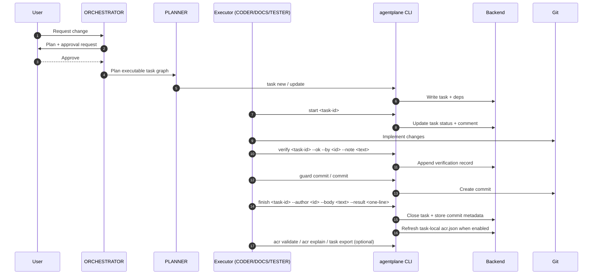
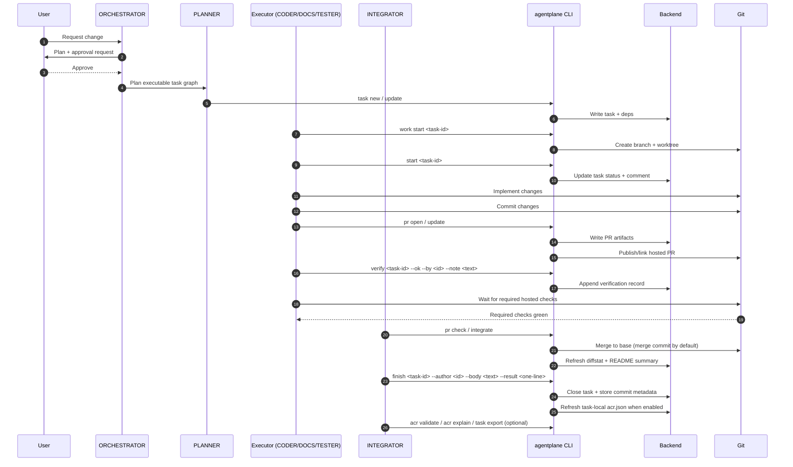

## Overview

## Minimal branch_pr lifecycle

This repository is configured for `branch_pr`, so the normal guarded route is:

1. Preflight.
2. Create the task and approve the plan.
3. `work start ... --worktree` on base, then execute implementation on the task branch/worktree.
4. Run `task start-ready`, implement, and commit implementation changes in the task worktree.
5. Keep PR artifacts current with `pr open` / `pr update`; normal `pr open` also publishes and links the hosted PR.
6. Run `task verify-show` and `verify` on the task branch, then wait for required remote checks.
7. Run `integrate` on the base branch only after verification and remote checks pass.
8. `finish` on the base branch with `--commit <git-rev>` and `--close-commit`.
9. Clean up the task worktree/branch after hosted merge closure.

```bash
agentplane config show
agentplane quickstart
agentplane task list
git status --short --untracked-files=no
agentplane work start <task-id> --agent <ROLE> --slug <slug> --worktree
agentplane task start-ready <task-id> --author <ROLE> --body "Start: ..."
git add <changed-files>
git commit -m "Implement <task>"
agentplane pr open <task-id> --branch task/<task-id>/<slug> --author <ROLE>
agentplane pr update <task-id>
agentplane task verify-show <task-id>
agentplane verify <task-id> --ok|--rework --by <ROLE> --note "..."
bun run workflow:wait-remote-checks
agentplane integrate <task-id> --branch task/<task-id>/<slug> --run-verify
agentplane finish <task-id> --author INTEGRATOR --body "Verified: ..." --result "..." --commit <git-rev> --close-commit
agentplane work end <task-id>
```

`direct` remains supported, but here it is an explicit alternative rather than the default guarded route.
`agentplane integrate` defaults to `merge` so task branch commits stay in base history; pass
`--merge-strategy squash` only when compacting history is intentional.

## Minimal direct lifecycle

If the repository is intentionally operating in `direct`, the shortest agent-first route is:

1. Preflight.
2. Create the task and approve the plan.
3. `task start-ready`.
4. Implement changes.
5. `task verify-show` -> `verify`.
6. `finish` with `--result` and `--commit`.

```bash
agentplane config show
agentplane quickstart
agentplane task list
git status --short --untracked-files=no
agentplane task start-ready <task-id> --author <ROLE> --body "Start: ..."
agentplane task verify-show <task-id>
agentplane verify <task-id> --ok|--rework --by <ROLE> --note "..."
agentplane finish <task-id> --author <ROLE> --body "Verified: ..." --result "..." --commit <git-rev>
```

Everything else in this document is either mode-specific detail or a fallback path.

A task moves through the same core stages in both modes:

1. **Intake**: a need is identified and recorded.
2. **Plan**: ORCHESTRATOR drafts a plan and requests approval.
3. **Create**: PLANNER creates the task, assigns ownership, and sets dependencies.
4. **Start**: the executor marks the task DOING with a structured comment.
5. **Implement**: code, docs, and artifacts are produced.
6. **Verify**: checks are run (if configured) and a verification outcome is recorded.
7. **Commit**: changes are committed with the task ID suffix.
8. **Finish**: the task is closed with a Verified note, commit metadata, and an Agent Change Record
   refresh when `acr.write_on_finish=true`.
9. **Evidence projection**: validate the task-local Agent Change Record against task, policy,
   verification, finish, and Git evidence.
10. **Export (optional)**: export a task snapshot for integrations (for example `agentplane task export`).

Task creation targets executable work only.
Task graph planning splits work into atomic tasks, each assigned to one specific owner.

The differences between modes are about **where** work happens and **who** performs closure.

## Lifecycle flow


```mermaid
flowchart TD
  A[Intake: need discovered] --> B[Plan: ORCHESTRATOR drafts plan]
  B --> C{Approval granted?}
  C -- No --> B
  C -- Yes --> D[Create task: PLANNER assigns owner + deps]
  D --> E[Start: executor sets DOING and Start comment]
  E --> F[Implement changes + docs]
  F --> G[Verify: run checks and record outcome]
  G --> H[Commit with task suffix]
  H --> I[Finish: Verified comment + commit metadata]
  I --> J[Export snapshot if needed]
```

## direct mode (single checkout)

**Where work happens:** in the current checkout.

**Who closes the task:** the executor (often CODER/DOCS/TESTER) after the implementation commit.

**Key outputs:**

- Task README and status updates are written directly in the repo.
- Verification records are appended to the task README under `## Verification` via `agentplane verify ...`.
- PR artifacts are optional in this mode.

### Sequence diagram (direct)


```mermaid
sequenceDiagram
  autonumber
  participant U as User
  participant O as ORCHESTRATOR
  participant P as PLANNER
  participant E as Executor (CODER/DOCS/TESTER)
  participant CLI as agentplane CLI
  participant B as Backend
  participant G as Git

  U->>O: Request change
  O->>U: Plan + approval request
  U-->>O: Approve
  O->>P: Plan executable task graph
  P->>CLI: task new / update
  CLI->>B: Write task + deps
  E->>CLI: start <task-id>
  CLI->>B: Update task status + comment
  E->>G: Implement changes
  E->>CLI: verify <task-id> --ok --by <id> --note <text>
  CLI->>B: Append verification record
  E->>CLI: guard commit / commit
  CLI->>G: Create commit
  E->>CLI: finish <task-id> --author <id> --body <text> --result <one-line>
  CLI->>B: Close task + store commit metadata
  CLI->>B: Refresh task-local acr.json when enabled
  E->>CLI: acr validate / acr explain / task export (optional)
```

## branch_pr mode

**Where work happens:** in a per-task branch/worktree.

**Who closes the task:** INTEGRATOR on the base branch after merge.

**Key outputs:**

- PR artifacts are required under `.agentplane/tasks/<task-id>/pr/`.
- Canonical task writes happen on the base branch only.
- Handoff notes are appended during review and carried into closure.
- Hosted PRs and server-side required checks are separate from local `agentplane pr ...` artifacts.

### Sequence diagram (branch_pr)


```mermaid
sequenceDiagram
  autonumber
  participant U as User
  participant O as ORCHESTRATOR
  participant P as PLANNER
  participant E as Executor (CODER/DOCS/TESTER)
  participant I as INTEGRATOR
  participant CLI as agentplane CLI
  participant B as Backend
  participant G as Git

  U->>O: Request change
  O->>U: Plan + approval request
  U-->>O: Approve
  O->>P: Plan executable task graph
  P->>CLI: task new / update
  CLI->>B: Write task + deps
  E->>CLI: work start <task-id>
  CLI->>G: Create branch + worktree
  E->>CLI: start <task-id>
  CLI->>B: Update task status + comment
  E->>G: Implement changes
  E->>G: Commit changes
  E->>CLI: pr open / update
  CLI->>B: Write PR artifacts
  CLI->>G: Publish/link hosted PR
  E->>CLI: verify <task-id> --ok --by <id> --note <text>
  CLI->>B: Append verification record
  E->>G: Wait for required hosted checks
  G-->>E: Required checks green
  I->>CLI: pr check / integrate
  CLI->>G: Merge to base (merge commit by default)
  CLI->>B: Refresh diffstat + README summary
  I->>CLI: finish <task-id> --author <id> --body <text> --result <one-line>
  CLI->>B: Close task + store commit metadata
  CLI->>B: Refresh task-local acr.json when enabled
  I->>CLI: acr validate / acr explain / task export (optional)
```

## Guardrails and policies

- **Approvals**: plan, network, and verification approvals are enforced via config (`agents.approvals.*`).
- **Preflight depth**:
  - `agentplane preflight` uses quick mode by default (fast, no backend task-list probe).
  - `agentplane preflight --mode full` adds backend task-list readiness checks.
- **Status comments**: start/block/finish require structured text (Start/Blocked/Verified).
- **Allowed status transitions**:
  - `TODO -> DOING|BLOCKED`
  - `DOING -> DONE|BLOCKED`
  - `BLOCKED -> TODO|DOING`
- **Status-commit major transitions**:
  - `TODO -> DOING`
  - `DOING -> BLOCKED`
  - `BLOCKED -> DOING`
  - `DOING -> DONE`
- **Two-stage verification**:
  - `## Verify Steps` is the ex-ante verification contract (criteria/protocol addressed to the verifier).
  - `## Verification` is the ex-post append-only record written by `agentplane verify ...`.
- **Task-local observations**:
  - Active `doc_version=3` tasks use `## Findings` for local deviations, follow-ups, and incident candidates.
  - Policy incidents are curated separately; they are not written directly from every task.
- **Primary-tag verification policy**:
  - Verify-step and verification requirements are controlled by `tasks.verify.require_steps_for_primary` and `tasks.verify.require_verification_for_primary`.
- **branch_pr verify logs**: `agentplane integrate --run-verify` executes frontmatter `verify:` commands and appends output to `.agentplane/tasks/<task-id>/pr/verify.log`.
- **Agent Change Record**: ACR is generated from the same lifecycle evidence, defaulting to
  `.agentplane/tasks/<task-id>/acr.json`; it must validate against task state rather than become a
  separate task source of truth.
- **Commit policy**: commit subjects must include the task ID suffix.
- **Duplicate closure shortcut**: for accidental duplicate tasks, use one command:
  - `agentplane task close-duplicate <task-id> --of <canonical-task-id> --author <ROLE>`
- **Preferred close flow (single command)**:
  - In `direct`, `agentplane finish <task-id> --author <ROLE> --body "Verified: ..." --commit <git-rev>` closes task metadata and creates the deterministic close commit in one step by default.
- **Exceptional/manual close paths**:
  - Use `--no-close-commit` only when you need to leave close handling manual.
  - In `branch_pr`, or when you want to be explicit, use `--close-commit`.
  - Add `--close-unstage-others` when unrelated staged files are present and you are using explicit `--close-commit`.
- **Docs updates**: task README sections are updated via `agentplane task doc set`; keep the active `doc_version` contract explicit when editing task docs.
- **Exports**: task snapshots are updated only via `agentplane` commands.

## Lifecycle and close taxonomy

The close surface is locked around one rule: a close command must make the
task state, task README, and git history agree about the terminal outcome. The
commands below differ by workflow mode and by whether the task is closed as
completed work, a no-op, a duplicate, or a hosted PR outcome.

| Command                                                              | Mode                                               | When to use                                                                        | Git writes                                                                            | Task docs writes                                                                    | Final status                                     |
| -------------------------------------------------------------------- | -------------------------------------------------- | ---------------------------------------------------------------------------------- | ------------------------------------------------------------------------------------- | ----------------------------------------------------------------------------------- | ------------------------------------------------ |
| `agentplane finish <task-id>`                                        | `direct`                                           | Normal close after local verification and an implementation commit.                | Creates the deterministic close commit by default.                                    | Appends the Verified close record, stores commit metadata, and updates frontmatter. | `DONE`                                           |
| `agentplane finish <task-id> --close-commit`                         | `branch_pr` base checkout or explicit direct close | Close after integration, or force the explicit close-commit path.                  | Creates the close commit after validating the close snapshot.                         | Same close metadata as `finish`; in `branch_pr`, the base task record is canonical. | `DONE`                                           |
| `agentplane finish <task-id> --no-close-commit`                      | `direct` fallback                                  | Leave close commit handling manual after recording the finish result.              | Records finish metadata without creating the deterministic close commit.              | `DONE`                                                                              |
| `agentplane task close-noop <task-id>`                               | `direct`                                           | Close a task that intentionally produced no implementation change.                 | Creates a task-only close/status commit when the command path requires one.           | Records the no-op reason in the task README.                                        | `DONE`                                           |
| `agentplane task close-duplicate <task-id> --of <canonical-task-id>` | `direct`                                           | Close an accidental duplicate and point to the canonical task.                     | Creates the close/status commit for the duplicate task record.                        | Records the duplicate relationship and terminal reason.                             | `DONE`                                           |
| `agentplane task hosted-close <task-id>`                             | `branch_pr` base checkout                          | Reconcile a task after a hosted PR merge already represents the shipped work.      | Records or reuses the hosted merge/close state on base.                               | Refreshes task and PR metadata from the hosted merge evidence.                      | `DONE`                                           |
| `agentplane task hosted-close-pr <task-id>`                          | `branch_pr` base checkout                          | Open or skip a follow-up close PR when hosted merge state needs base-side closure. | May create a follow-up close branch/PR unless the canonical close is already present. | Recreates or refreshes base PR metadata before deciding the close route.            | `DONE` or no-op when already closed              |
| `agentplane pr close <task-id>`                                      | `branch_pr` task PR                                | Close an open hosted PR without marking the task completed.                        | Uses the hosted provider and may delete the remote head branch.                       | Updates local PR artifacts when the command path has a task context.                | Task status unchanged                            |
| `agentplane pr close-superseded <task-id>`                           | `branch_pr` task PR                                | Close a PR for work that was superseded by another task or branch.                 | Closes the hosted PR and may delete the remote branch.                                | Records superseded close evidence in PR artifacts.                                  | Task status unchanged unless separately finished |

Use `finish` for normal completion. Use `close-noop` and `close-duplicate`
only when the terminal reason is not "implemented and verified". Use `pr close`
commands for hosted PR lifecycle only; they are not substitutes for task
closure.

## Related docs

- [Agent bootstrap](agent-bootstrap.generated)
- [Workflow](workflow)
- [Branching and PR artifacts](branching-and-pr-artifacts)
- [Tasks and backends](tasks-and-backends)
- [Configuration](configuration)
- [Developer close taxonomy](../developer/close-taxonomy)
