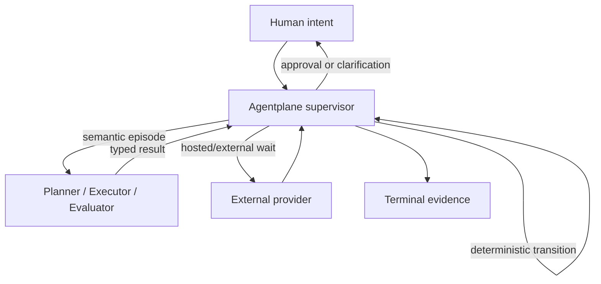

## Overview

Agentplane 0.7 exposes one supervisor state machine through two execution styles:

- `task advance --agent-json` returns one compact action to an external agent;
- `task run <task-id>` resolves eligible semantic episodes through the configured managed runner.

Agentplane owns formal process state: plan persistence, approvals, task transitions, checkout
routing, worktrees, PR artifacts, verification records, integration, recovery, closure, and cleanup.
The model owns only the work that needs semantic judgment.

The supervisor never converts an approval, unresolved question, hosted wait, stale state, or
effect-in-doubt boundary into success. It returns a typed stop and waits for the appropriate human,
provider, or recovery action.

## External-agent route

Select ready work and request one bounded packet:

```bash
agentplane task active
agentplane task advance <task-id> --agent-json
```

When `action.kind=agent_episode`:

1. Read the supplied objective, role, authority, context references, required output, and stop rules.
2. Perform only that semantic objective in the supplied checkout and writable roots.
3. Write a typed semantic result to the result location supplied by the packet.
4. Resume with the return invocation supplied by Agentplane.
5. Request a fresh packet after every state change.

Do not reconstruct the state machine from prose. Do not switch checkout, create branches, publish
PRs, persist verification, integrate, close, or clean up during a normal semantic episode.

The external loop stops at one of these boundaries:

- another semantic episode;
- human approval or clarification;
- hosted or external provider work;
- stale state or effect-in-doubt recovery;
- terminal completion.

## Managed-runner route

With a configured runner, the normal path is:

```bash
agentplane task run <task-id>
```

`task run` uses the same route decision, state fingerprint, WorkOrder, authority, result contract,
verification boundary, and execution journal as `task advance`. The difference is only who resolves
the semantic episode: an external caller or the configured runner adapter.

The managed runner also stops at human approval, hosted/external, stale-state, effect-in-doubt, and
terminal boundaries. Rerun `task run` only after the returned boundary has been resolved.

## First complete workflow

Create a task and let the managed supervisor resolve its planning episode:

```bash
TASK_ID=$(agentplane task new --title "Inspect Agentplane artifacts" --description "Review the generated task record and summarize what Agentplane created" --owner DOCS --tag docs)
agentplane task run "$TASK_ID"
```

The first run stops at the human approval boundary after a task-specific semantic plan exists. Run
the exact approval action printed by Agentplane, then continue:

```bash
agentplane task run "$TASK_ID"
```

For an external agent, use `task advance "$TASK_ID" --agent-json` instead and follow the typed
result exchange described above. No manual lifecycle choreography is required from the agent.

## Planning and approval

A newly created task contains a non-approvable placeholder, not synthetic semantic evidence.
`task advance` returns a read-only PLANNER episode; `task run` resolves the same planning episode
through the configured adapter. Agentplane persists the returned plan and then stops for human
approval when policy requires it.

Only a human/operator may satisfy an approval boundary. An agent must not approve its own plan or
infer approval from earlier prose.

## Semantic WorkOrder

Each semantic episode receives a bounded WorkOrder containing:

- one approved objective;
- the semantic role and mutation/network authority;
- the authoritative checkout and writable roots;
- required inputs and prepared context references;
- output schema and result location;
- verification intent;
- stop rules and state fingerprint.

The packet stays compact. Large context remains behind references so the agent loads only what the
current objective needs.

## Direct and branch_pr modes

Both modes use the same external and managed supervisor protocols.

### `direct`

Semantic work runs in the current checkout. Agentplane owns formal task transitions, verification
persistence, commits, and closure.

### `branch_pr`

Agentplane creates or resumes the task worktree, binds the WorkOrder to that checkout, maintains PR
artifacts, waits for hosted checks, serializes integration, records hosted close, and performs safe
cleanup. The external caller does not change cwd or derive branch names.

The human still controls review and publication policy. User-authenticated GitHub actions remain
user-attributed external effects and require the matching operator authority.

## Evidence and trust boundary

The semantic result reports what the agent attempted and observed. Agentplane separately records
process, Git, filesystem, artifact, provider, and check facts.

- Agent-reported checks are not persisted as observed verification without supervisor evidence.
- Managed provider token usage is counted exactly once from observed receipts.
- External, malformed, legacy, or partially observed usage stays `partial` or `unavailable`; the CLI
  does not accept model-supplied token totals or fabricate zeroes.
- Independent evaluator evidence stays distinct from executor claims.
- Terminal completion requires the configured observed verification and quality gates.

## Diagnostics and recovery

The normal agent protocol is `task advance` or `task run`. The following surfaces are diagnostic:

```bash
agentplane task brief <task-id>
agentplane task status <task-id> --route
agentplane task next-action <task-id> --explain
agentplane doctor
```

Use them when a human/operator is investigating drift or when Agentplane explicitly returns a
manual recovery boundary. Low-level task, worktree, PR, verification, integration, release, and
cleanup commands remain available through `agentplane help --all`; they are not the agent happy
path.

Never execute a raw route string as shell. Use typed action fields and exact argv returned by the
CLI.

## Lifecycle model


```mermaid
flowchart TD
  U["Human intent"] --> CLI["Agentplane supervisor"]
  CLI -->|"semantic episode"| A["Planner / Executor / Evaluator"]
  A -->|"typed result"| CLI
  CLI -->|"approval or clarification"| U
  CLI -->|"deterministic transition"| CLI
  CLI -->|"hosted/external wait"| X["External provider"]
  X --> CLI
  CLI --> T["Terminal evidence"]
```

The lifecycle still contains intake, planning, approval, execution, verification, review,
integration, and closure. Those stages are CLI state, not a procedure the semantic agent must
memorize.

## Guardrails

- Plans, network actions, verification records, and external effects respect repository approval
  policy.
- Every packet is bound to a state fingerprint; stale results are rejected.
- Effects are journaled so interruption and process loss do not blindly replay ambiguous work.
- `branch_pr` WorkOrders bind semantic writes to the task worktree.
- Agentplane-owned task, PR, quality, integration, and cleanup artifacts are not model-owned state.
- Manual compatibility commands require explicit operator/recovery context.

## Related docs

- [Quickstart](../start/quickstart)
- [Workflow](workflow)
- [Branching and PR artifacts](branching-and-pr-artifacts)
- [Tasks and backends](tasks-and-backends)
- [Configuration](configuration)
- [Migrate to Agentplane 0.7](v0-7-migration)
