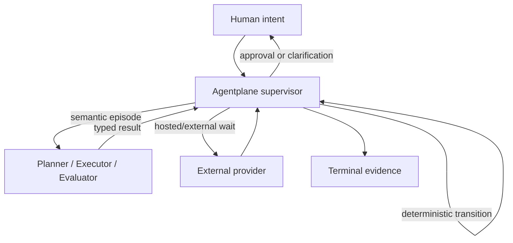

## Overview

Agentplane 0.7 exposes one supervisor state machine through two execution styles:

- `task advance --agent-json` returns one compact action to an external agent;
- `task run <task-id>` resolves eligible semantic episodes through the configured managed runner.

Agentplane owns formal process state: plan persistence, approvals, task transitions, checkout
routing, worktrees, PR artifacts, verification records, integration, recovery, closure, and cleanup.
The model owns only the work that needs semantic judgment.

The supervisor never converts an approval, unresolved question, hosted wait, stale state, or
effect-in-doubt boundary into success. It returns a typed stop and waits for the appropriate human,
provider, or recovery action.

## External-agent route

Select ready work and request one bounded packet:

```bash
agentplane task active
agentplane task advance <task-id> --agent-json
```

When `action.kind=agent_episode`:

1. Read the supplied objective, role, authority, context references, required output, and stop rules.
2. Perform only that semantic objective in the supplied checkout and writable roots.
3. Write a typed semantic result to the exact `exchange.result_path` supplied by the packet.
4. Resume with the exact `exchange.resume_argv`; `exchange.return_invocation` is compatibility-only.
5. Request a fresh packet after every state change.

Do not reconstruct the state machine from prose. Do not switch checkout, create branches, publish
PRs, persist verification, integrate, close, or clean up during a normal semantic episode.

The external loop stops at one of these boundaries:

- another semantic episode;
- human approval or clarification;
- hosted or external provider work;
- stale state or effect-in-doubt recovery;
- terminal completion.

## Managed-runner route

With a configured runner, the normal path is:

```bash
agentplane task run <task-id>
```

`task run` uses the same route decision, state fingerprint, WorkOrder, authority, result contract,
verification boundary, and execution journal as `task advance`. Before a task-specific plan exists,
`task run` returns `semantic_input_required`; obtain and return the initial PLANNER result through
`task advance`. After planning and approval, eligible semantic episodes may be resolved by either an
external caller or the configured runner adapter.

The managed runner also stops at human approval, hosted/external, stale-state, effect-in-doubt, and
terminal boundaries. Rerun `task run` only after the returned boundary has been resolved.

## First complete workflow

Create a task and request its bounded planning episode:

```bash
agentplane task create "Inspect Agentplane artifacts and summarize what was created"
```

Run the exact `task advance` command in the response and give its packet to an external agent. It
reads `exchange.work_order_ref`, performs only the PLANNER objective, writes a typed result matching
`exchange.result_schema_ref` to `exchange.result_path`, and resumes with the exact
`exchange.resume_argv`. Its equivalent shell form is:

```bash
agentplane task advance <task-id> --result <exchange-directory>/result.json --agent-json
```

Agentplane persists the semantic plan and emits a typed approval request if human approval is
required. A host such as Codex may return a `host_user_decision` event that is bound to the task,
plan digest, and route fingerprint. Agentplane compiles the approved plan and declared execution
scope into a task-local execution grant. The supervisor then continues deterministic lifecycle,
workspace, PR, verification, integration, and closure operations without requesting approval for
each step covered by that grant.

After approval, use `task run` for an eligible configured managed-runner episode; an external host
may instead keep returning typed `task advance` results through the same supervisor contract.

An evaluator `rework` verdict is not a new user boundary. In `branch_pr` mode the bounded supervisor
selects the resulting implementation-rework episode, verifies it again, and repeats review inside
the same grant. Human review, blocked evidence, material drift, an external wait, or the bounded
step budget still stops the loop.

The supervisor stops again only when the plan or declared scope changes, a new user decision is
required, an external wait cannot be resolved yet, an effect is in doubt, or the task reaches a
terminal boundary. No manual lifecycle choreography is required from the agent or user.

## Planning and approval

A newly created task contains a non-approvable placeholder, not synthetic semantic evidence.
`task advance` returns a read-only PLANNER episode; `task run` returns
`semantic_input_required` until that result has been supplied through the external protocol.
Agentplane persists the returned plan and then stops for human approval when policy requires it.

Only a user-originated host event, a valid signed user receipt, or an explicit operator command may
satisfy an approval boundary. An agent must not manufacture the event, approve its own plan, or
infer approval from unrelated prose. Editing the plan or execution scope invalidates the execution
grant and returns the task to approval.

### Host approval event

When no signed-receipt issuer is configured, the action packet uses the host transport and includes
the exact `task_id`, `plan_digest`, and `state_fingerprint` to bind. The host adds its identity,
conversation/message identity, decision time, and `origin: user`, encodes the event as canonical
base64url JSON, and invokes the exact returned `--host-user-decision` action. AgentPlane treats the
host boundary as the source of user provenance; the repository process does not claim to
cryptographically identify the person behind the host.

## Semantic WorkOrder

Each semantic episode receives a bounded WorkOrder containing:

- one approved objective;
- the semantic role and mutation/network authority;
- the authoritative checkout and writable roots;
- required inputs and prepared context references;
- output schema and result location;
- verification intent;
- stop rules and state fingerprint.

The packet stays compact. Large context remains behind references so the agent loads only what the
current objective needs.

## Direct and branch_pr modes

Both modes use the same external and managed supervisor protocols.

### `direct`

Semantic work runs in the current checkout. Agentplane owns formal task transitions, verification
persistence, commits, and closure.

### `branch_pr`

Agentplane creates or resumes the task worktree, binds the WorkOrder to that checkout, maintains PR
artifacts, waits for hosted checks, serializes integration, records hosted close, and performs safe
cleanup. The external caller does not change cwd or derive branch names.

The approved execution grant may cover reversible provider operations, integration, publication,
or deployment only when those capabilities are present in the frozen execution contract. A
compiler-discovered writable-root extension can proceed without another confirmation only when
every inferred repository effect is already allowed by the approved contract. A new effect,
repository identity, logical completion requirement, or risk envelope is material drift and returns
to the user.

## Evidence and trust boundary

The semantic result reports what the agent attempted and observed. Agentplane separately records
process, Git, filesystem, artifact, provider, and check facts.

- Agent-reported checks are not persisted as observed verification without supervisor evidence.
- Managed provider token usage is counted exactly once from observed receipts.
- External, malformed, legacy, or partially observed usage stays `partial` or `unavailable`; the CLI
  does not accept model-supplied token totals or fabricate zeroes.
- Independent evaluator evidence stays distinct from executor claims.
- Terminal completion requires the configured observed verification and quality gates.

## Diagnostics and recovery

The normal agent protocol is `task advance` or `task run`. The following surfaces are diagnostic:

```bash
agentplane task brief <task-id>
agentplane task status <task-id> --route
agentplane task next-action <task-id> --explain
agentplane doctor
```

Use them when a human/operator is investigating drift or when Agentplane explicitly returns a
manual recovery boundary. Low-level task, worktree, PR, verification, integration, release, and
cleanup commands remain available through `agentplane help --all`; they are not the agent happy
path.

Never execute a raw route string as shell. Use typed action fields and exact argv returned by the
CLI.

### Interrupted integration effects

If an `integration.run_next` intent has no recorded outcome, `task advance` stops before issuing
semantic rework. The diagnostic includes the task, journal digest, operation key, original
precondition fingerprint, authority reference and digest, effect reference, and current route
fingerprint. New intents also retain their original typed operation and queue/provider snapshot.
Older intents remain unchanged; missing history is never reconstructed from the current route.

An operator can reconcile one exact intent with:

```bash
agentplane task advance <task-id> --workflow-recovery <operator-resolution.json> --remote --agent-json
```

This command requires an explicit operator decision about the historical effect. A currently open
PR does not establish that the interrupted worker never applied an effect. An agent must not invent
a verdict, operator identity, decision reference, or missing snapshot. If the outcome is unknown,
keep the intent unresolved and obtain the worker outcome or another authoritative observation.

The input is a strict JSON object with these fields:

| Field                                             | Required value                                                                       |
| ------------------------------------------------- | ------------------------------------------------------------------------------------ |
| `schema_version`, `kind`                          | `1`, `"integration_effect_resolution"`                                               |
| `task_id`, `repository_root`                      | Exact task ID and canonical absolute path of its base checkout                       |
| `journal_digest`, `operation_key`                 | The unresolved journal digest and original operation key                             |
| `precondition_fingerprint_digest`                 | The original intent fingerprint, never the current route fingerprint                 |
| `authority_ref`, `authority_digest`, `effect_ref` | Exact values from the original journal operation                                     |
| `current_state_fingerprint`                       | Fresh remote-aware route fingerprint for this task                                   |
| `identity`                                        | Exact branch, head/base SHAs, PR, and provider identity described below              |
| `verdict`                                         | `"not_applied"` or `"applied"`, supplied by the operator                             |
| `operator`                                        | `kind: "operator_decision"`, `actor`, `decision_ref`, and ISO `observed_at`          |
| `evidence`                                        | A nonempty array of objects containing `ref`, exact text `content`, and its `digest` |

`identity` contains `branch`, `head_sha`, `base`, `base_sha`, `pr_number`, `pr_url`, and `provider`.
The provider object contains `provider` (`github` or `gitlab`), `hostname`, `remote`, `sourceProject`,
`targetProject`, `sourceUrl`, and `targetUrl`. Preserve the provider's exact normalized values.
All digest fields use `sha256:<64 lowercase hex characters>`. For each evidence string, compute
`sha256:` plus the SHA-256 hash of UTF-8 `JSON.stringify(content)`; this binds the exact text,
including whitespace. The observation time must be at or after the intent start and not in the future.

Recovery holds the supervisor lease and integration queue mutex. It checks the journal identity,
the fresh route, queue ownership, provider identity, PR head/base, and local Git references. It
rejects stale or contradictory evidence and any active queue owner. For `not_applied`, the PR must
remain open, the queue entry must be queued or awaiting rework, and the fresh route must authorize
`implementation_rework`. For `applied`, the provider and queue must record a completed merge that
is present on the local base. A verdict cannot replace these independent checks.

The command records the outcome with compare-and-swap and returns `task_id`, `operation_key`,
`verdict`, and `replay`. It does not merge, enqueue, retry the integration worker, or issue a semantic
episode. After `not_applied`, request a fresh `task advance --remote --agent-json` packet; the
supervisor can issue one distinct rework successor. An identical recovery input returns
`replay: true` after the outcome is persisted, including after a lost response or after the successor
has started. Keep the original input unchanged when retrying after an interruption. A different
outcome for the same operation is rejected.

## Lifecycle model


```mermaid
flowchart TD
  U["Human intent"] --> CLI["Agentplane supervisor"]
  CLI -->|"semantic episode"| A["Planner / Executor / Evaluator"]
  A -->|"typed result"| CLI
  CLI -->|"approval or clarification"| U
  CLI -->|"deterministic transition"| CLI
  CLI -->|"hosted/external wait"| X["External provider"]
  X --> CLI
  CLI --> T["Terminal evidence"]
```

The lifecycle still contains intake, planning, approval, execution, verification, review,
integration, and closure. Those stages are CLI state, not a procedure the semantic agent must
memorize.

## Guardrails

- Plans, network actions, verification records, and external effects respect repository approval
  policy.
- Every packet is bound to a state fingerprint; stale results are rejected.
- Effects are journaled so interruption and process loss do not blindly replay ambiguous work.
- `branch_pr` WorkOrders bind semantic writes to the task worktree.
- Agentplane-owned task, PR, quality, integration, and cleanup artifacts are not model-owned state.
- Manual compatibility commands require explicit operator/recovery context.

## Related docs

- [Quickstart](../start/quickstart)
- [Workflow](workflow)
- [Branching and PR artifacts](branching-and-pr-artifacts)
- [Tasks and backends](tasks-and-backends)
- [Configuration](configuration)
- [Migrate to Agentplane 0.7](v0-7-migration)
