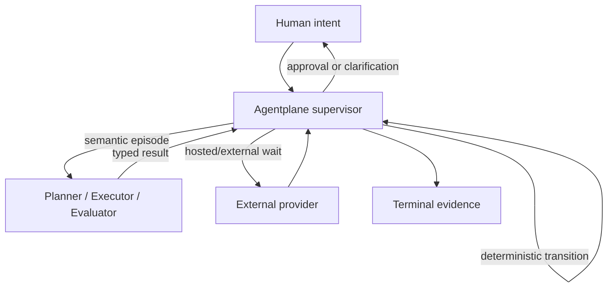

## Overview

Agentplane 0.7 exposes one supervisor state machine through two execution styles:

- `task advance --agent-json` returns one compact action to an external agent;
- `task run <task-id>` resolves eligible semantic episodes through the configured managed runner.

Agentplane owns formal process state: plan persistence, approvals, task transitions, checkout
routing, worktrees, PR artifacts, verification records, integration, recovery, closure, and cleanup.
The model owns only the work that needs semantic judgment.

The supervisor never converts an approval, unresolved question, hosted wait, stale state, or
effect-in-doubt boundary into success. It returns a typed stop and waits for the appropriate human,
provider, or recovery action.

## Lifecycle ownership

All current task entrypoints use one ownership chain. The Task Kernel is the sole pure reducer,
`KernelBackendAdapter.persist` is the sole canonical writer, and `advanceTaskStep` is the sole
application coordinator. `task advance` and `task run` are external and managed transports over
that same coordinator; neither is a second engine. Agents choose neither an engine nor an owner.

The Kernel and coordinator own formal decisions: transition admission, authority checks,
persistence, effect execution and observation, recovery, verification persistence, integration,
and closure. Semantic agents own bounded judgment only: PLANNER proposes the plan, EXECUTOR performs
an authorized work item, and EVALUATOR independently assesses it. In 0.7.12 a sufficient supplied
Plan can satisfy planning without a separate PLANNER episode. Required independent evaluation
does not become optional.

The current public domain API is the `taskKernel` namespace from `@agentplaneorg/core/tasks`.
Task-centric graph, policy, model, and compatibility exports are pure or conversion-only helpers;
they do not provide an executable lifecycle loop. The application coordinator is not a public core
execution API.

## External-agent route

Select ready work and request one bounded packet:

```bash
agentplane task active
agentplane task advance <task-id> --agent-json
```

When `action.kind=agent_episode`:

1. Read the supplied objective, role, authority, context references, required output, and stop rules.
2. Perform only that semantic objective in the supplied checkout and writable roots.
3. Write a typed semantic result to the exact `exchange.result_path` supplied by the packet.
4. Resume with the exact `exchange.resume_argv`; `exchange.return_invocation` is compatibility-only.
5. Request a fresh packet after every state change.

Do not reconstruct the state machine from prose. Do not switch checkout, create branches, publish
PRs, persist verification, integrate, close, or clean up during a normal semantic episode.

The external loop stops at one of these boundaries:

- another semantic episode;
- human approval or clarification;
- hosted or external provider work;
- stale state or effect-in-doubt recovery;
- terminal completion.

## Transport ownership recovery

An issued exchange has one transport owner. Switching from external `task advance` to managed
`task run`, or back, does not transfer that ownership. A conflict reports
`canonical_transport_owner_conflict`, the owner, requested transport, authoritative checkout,
WorkOrder ID and exact `continuation_argv`. Resume the owning transport in that checkout.
For an external exchange, complete its typed result before using the emitted result command.
Do not delete `transport-owner.json` or synthesize a result to change owners.

## Managed-runner route

With a configured runner, the normal path is:

```bash
agentplane task run <task-id>
```

`task run` uses the same route decision, state fingerprint, WorkOrder, authority, result contract,
verification boundary, and execution journal as `task advance`. The coordinator first resolves
the planning obligation. Sufficient caller input proceeds to ordinary approval without PLANNER;
required planning uses a read-only PLANNER episode. Managed execution requires an adapter with
enforceable read-only sandbox support and supervised typed results. Advisory adapters fail before
launch, and an unverified runtime receipt cannot admit a planning result. Use the external
`task advance` route when the managed runtime cannot satisfy this contract.

The managed runner also stops at human approval, hosted/external, stale-state, effect-in-doubt, and
terminal boundaries. Rerun `task run` only after the returned boundary has been resolved.

## Consumer recovery

### Explicit implementation intake

Declare writable paths and effects when creating a code task. For example:

```bash
agentplane task create "Repair parser and regression tests" \
  --scope-root src --scope-root tests \
  --repository-effect source_code --repository-effect tests \
  --capability repository_write
```

The intake contract is a ceiling, not a substitute for Plan approval or the current WorkOrder.
The Plan must include the intended work, required checks and matching execution requirements.
A code change also needs the tests effect when it modifies tests. Do not expand authority by
editing native task files. Follow the returned operator approval route for an actual scope change.

### Canonical recovery

Use `agentplane task status <task-id> --route` for operator inspection. Shared canonical reads
resolve the owning task checkout even when invoked from the base checkout. Keep unrelated
dirty-base edits in place; native preparation records their unchanged fingerprint and admits
only the registered clean task checkout at its expected commit.

After a failed final check, AgentPlane retains the failed evidence and returns either an
infrastructure retry or a bounded corrective Plan. Inspect the supplied proposal and use its
exact `approval_argv` only with explicit USER approval. Corrective work must pass implementation,
checks and independent review again. Previously completed work and failed evidence remain recorded.
An infrastructure failure is not permission to rewrite source or skip the check.

An uncertain write is an `E_HANDOFF` boundary, not proof of success or a legacy migration request.
Preserve its evidence and follow the returned recovery route. For a genuinely legacy task,
`agentplane task kernel-migrate <task-id>` performs read-only inspection. Applying a migration
requires the exact source digest and explicit operator admission. It cannot repair a missing,
quarantined or effect-in-doubt canonical record.

Canonical comments use native audit metadata. Administrative duplicate, superseded and no-op
closure requires the explicit `--approved-by USER` option on the returned operator command;
an author named USER, `--force`, or a comment is not approval. Administrative closure records
cancellation, not verified implementation success. Begun work and unresolved effects block it.
`task scaffold --force` cannot overwrite canonical identity.

### Relocated hook installations

Managed consumer shims prefer an explicit `AGENTPLANE_HOOK_RUNNER`, then repository-local and
pinned installed runners. Current shims can use `AGENTPLANE_RUNTIME_ACTIVE_BIN` when the pinned
installation is gone. Global PATH fallback still requires `AGENTPLANE_HOOK_ALLOW_GLOBAL=1`.
Hook failures remain failures; runner selection does not bypass hooks.

Native implementation commits and guarded commits check managed shim readiness before staging.
An older shim without an available runner returns `hook_runner_unavailable` with a checkout-bound
repair command. Run `agentplane hooks install --root <checkout>` from the active installation,
then retry the original operation. Keep hooks enabled and preserve existing staged user files.

### Consumer regression coverage

The following source tests document the repaired behavior. Paths are relative to
`packages/agentplane/src` unless stated otherwise. Passing fixtures do not replace the current
task's native checks, independent review, integration or release gates.

| Issue | Behavior                                                         | Regression test                                                                                            |
| ----- | ---------------------------------------------------------------- | ---------------------------------------------------------------------------------------------------------- |
| #6054 | Explicit code/tests intake through native lifecycle              | `commands/task/kernel-scoped-intake.test.ts`                                                               |
| #6067 | Retained final failure and approved corrective cycle             | `commands/task/kernel-final-validation.test.ts`, `commands/task/kernel-scoped-intake.test.ts`              |
| #6068 | Dirty-base preservation and exact clean-worktree receipt         | `commands/task/kernel-worktree-preparation.test.ts`, `commands/branch/work-start.materialize.test.ts`      |
| #6069 | Shared canonical owner read/projection consistency               | `commands/shared/canonical-task-owner.test.ts`                                                             |
| #6070 | Uncertain write and canonical-state diagnostics                  | `commands/task/kernel-runtime-diagnostics.test.ts`, `adapters/task-backend/kernel-backend-adapter.test.ts` |
| #6071 | Unrelated missing task README does not block target mutation     | `commands/shared/reconcile-canonical-scope.test.ts`                                                        |
| #6072 | Native audit and authorized administrative closure               | `commands/task/kernel-bookkeeping.test.ts`, core `src/tasks/task-kernel/bookkeeping.test.ts`               |
| #6073 | Missing pinned installation, active runner, override and failure | `commands/branch/work-start.hook-shim.test.ts`                                                             |
| #6074 | Transport conflict includes owning continuation                  | `commands/task/kernel-exchange.test.ts`                                                                    |
| #6075 | Unicode duplicate matching                                       | `commands/task/new-duplicates.test.ts`                                                                     |
| #6076 | Direct full-catalog help without `--all`                         | `cli/help.all-commands.contract.test.ts`, `cli/run-cli.core.help-contract.test.ts`                         |
| #6077 | Typed expected authority/lifecycle rejections                    | `commands/task/kernel-runtime-diagnostics.test.ts`, `runner/usecases/kernel-authority.test.ts`             |
| #6078 | Mixed legacy/canonical active-task selection                     | `commands/task/active.command.unit.test.ts`                                                                |
| #6079 | Canonical identity survives forced scaffold attempts             | `commands/shared/canonical-task-owner.test.ts`                                                             |

Issue #6050 is an optional third-party integration proposal, not a required lifecycle defect fix.
It needs a separate product decision, endpoint and data-disclosure review, dependency assessment
and explicit integration scope. This repair work neither contacts that endpoint nor adds its
dependency. Package versions and release metadata are unchanged.

## First complete workflow

Create a task and request its bounded planning episode:

```bash
agentplane task create "Inspect Agentplane artifacts and summarize what was created"
```

Run the exact `task advance` command in the response and give its packet to an external agent. It
reads `exchange.work_order_ref`, performs only the PLANNER objective, writes a typed result matching
`exchange.result_schema_ref` to `exchange.result_path`, and resumes with the exact
`exchange.resume_argv`. Its equivalent shell form is:

```bash
agentplane task advance <task-id> --result <exchange-directory>/result.json --agent-json
```

Agentplane persists the semantic plan and compares it with the trusted execution contract captured
at task intake. When `agents.approvals.require_plan` is false, an exact repository-only subset with
bounded risk may receive `repository_policy` approval. That path records SYSTEM provenance; it does
not impersonate a user. Other plans emit a typed approval request. A host such as Codex may return a
`host_user_decision` event that is bound to the task, plan digest, and route fingerprint. Agentplane
compiles the approved plan and declared execution scope into a task-local execution grant. The
supervisor then continues deterministic lifecycle, workspace, PR, verification, integration, and
closure operations without requesting approval for each step covered by that grant.

After approval, use `task run` for an eligible configured managed-runner episode; an external host
may instead keep returning typed `task advance` results through the same supervisor contract.

An evaluator `rework` verdict is not a new user boundary. In `branch_pr` mode the bounded supervisor
selects the resulting implementation-rework episode, verifies it again, and repeats review inside
the same grant. Human review, blocked evidence, material drift, an external wait, or the bounded
step budget still stops the loop.

The supervisor stops again only when the plan or declared scope changes, a new user decision is
required, an external wait cannot be resolved yet, an effect is in doubt, or the task reaches a
terminal boundary. No manual lifecycle choreography is required from the agent or user.

## Planning and approval

A newly created task without sufficient planning input contains a non-approvable placeholder,
not synthetic semantic evidence. Both transports use the common planning-obligation resolver.
`task create --plan-file <path>` accepts an existing compact v2 or full v1 proposal. Native intake
binds it to the new task and current baseline; an issued semantic result must still match its
exact task and WorkOrder identity. The original normalized input is retained by digest.

With `--plan-file`, the create response reports `status: "advance_required"` and
`required_role: null`: only the next coordinator packet decides whether PLANNER is needed.
Without supplied input, the existing `semantic_input_required` intake response is unchanged.

A fresh, sufficient proposal within the trusted contract becomes a proposed Plan without a
separate PLANNER dispatch. Missing input, unresolved questions, unsupported checks, stale evidence,
or `agents.approvals.require_planner=true` preserve the planning requirement. Malformed input is
rejected rather than repaired by guessing. Failed required planning cannot silently become a
successful skip. With no Recipe, ordinary obligation resolution still applies.

Agentplane persists an admitted Plan and then stops for human approval when policy requires it.
Planning input is never user approval. Supplying it does not relax verification, independent
EVALUATOR review, repository scope, capability limits, or external authority.

### Compatibility and evidence

Full v1 and compact v2 proposal input are accepted through the existing normalizer. These input
versions do not select a lifecycle engine or replace canonical task state. Version 0.7.12 adds
immutable `plan_inputs` documents and `plan_input_digest` references. Records without those
optional fields remain supported. Strict older writers may reject or lose new provenance fields;
do not use an older CLI to mutate tasks written with supplied-plan provenance. Upgrade all task
writers together. A rollback requires restoring a consistent pre-upgrade repository and task-state
backup, not deleting the new fields or converting an old approval into current authority.

Planning views distinguish `required` from `not_required`, caller origin from planner origin,
and current evidence from historical evidence. A retained failed attempt is not erased by a later
success. Local journal counts do not establish total external attempts; missing costs and totals
are unknown rather than zero.

Installed-package tests qualify local route behavior. They do not certify live provider
containment or full-host efficiency. The [M04 disposition](../releases/v0.7.12-m04.md) is
**NOT ESTABLISHED**: upstream construction and retry costs and both latency endpoints are unknown.
Independent review remains required, and no 0.7.13 Recipe contract or 0.7.14 review omission is
introduced.

### Approval provenance

An exact contract-bounded repository Plan may be approved by repository policy when explicit plan
approval is disabled. Every remaining approval boundary requires a user-originated host event, a
valid signed user receipt, or an explicit operator command. An agent must not manufacture any of
these decisions, approve its own plan, or infer approval from unrelated prose. Editing the plan or
execution scope invalidates the execution grant and returns the task to approval.

The four approval routes have different provenance:

- `repository_policy` is controller-owned automation with SYSTEM provenance and no external effects;
- `host_user_decision` is an authenticated host observation with USER provenance;
- `signed_user_receipt` is a verified trusted-issuer receipt with USER provenance;
- manual `task plan approve --by USER` is an operator/bootstrap compatibility route.

### Host approval event

When no signed-receipt issuer is configured, the action packet uses the host transport and includes
the exact `task_id`, `plan_digest`, and `state_fingerprint` to bind. The host adds its identity,
conversation/message identity, decision time, and `origin: user`, encodes the event as canonical
base64url JSON, and invokes the exact returned `--host-user-decision` action. AgentPlane treats the
host boundary as the source of user provenance; the repository process does not claim to
cryptographically identify the person behind the host.

## Semantic WorkOrder

Each semantic episode receives a bounded WorkOrder containing:

- one approved objective;
- the semantic role and mutation/network authority;
- the authoritative checkout and writable roots;
- required inputs and prepared context references;
- output schema and result location;
- verification intent;
- stop rules and state fingerprint.

The packet stays compact. Large context remains behind references so the agent loads only what the
current objective needs.

## Direct and branch_pr modes

Both modes use the same external and managed supervisor protocols.

### `direct`

Semantic work runs in the current checkout. Agentplane owns formal task transitions, verification
persistence, commits, and closure.

### `branch_pr`

Agentplane creates or resumes the task worktree, binds the WorkOrder to that checkout, maintains PR
artifacts, waits for hosted checks, serializes integration, records hosted close, and performs safe
cleanup. The external caller does not change cwd or derive branch names.

The approved execution grant may cover reversible provider operations, integration, publication,
or deployment only when those capabilities are present in the frozen execution contract. A
compiler-discovered writable-root extension can proceed without another confirmation only when
every inferred repository effect is already allowed by the approved contract. A new effect,
repository identity, logical completion requirement, or risk envelope is material drift and returns
to the user.

## Evidence and trust boundary

The semantic result reports what the agent attempted and observed. Agentplane separately records
process, Git, filesystem, artifact, provider, and check facts.

- Agent-reported checks are not persisted as observed verification without supervisor evidence.
- Managed provider token usage is counted exactly once from observed receipts.
- Provider token usage is informational for every user and is independent of subscription or
  provider-billing authentication. Token caps default to disabled and require an explicit user
  action; episode, agent-run, wall-time, changed-file, and no-progress safety limits stay active.
- External, malformed, legacy, or partially observed usage stays `partial` or `unavailable`; the CLI
  does not accept model-supplied token totals or fabricate zeroes.
- Independent evaluator evidence stays distinct from executor claims.
- Terminal completion requires the configured observed verification and quality gates.

## Diagnostics and recovery

The normal agent protocol is `task advance` or `task run`. The following surfaces are diagnostic:

```bash
agentplane task brief <task-id>
agentplane task status <task-id> --route
agentplane task next-action <task-id> --explain
agentplane doctor
```

Use them when a human/operator is investigating drift or when Agentplane explicitly returns a
manual recovery boundary. Low-level task, worktree, PR, verification, integration, release, and
cleanup commands remain available through `agentplane help --all`; they are not the agent happy
path.

Never execute a raw route string as shell. Use typed action fields and exact argv returned by the
CLI.

### Historical lifecycle conversion: 0.7.10 and earlier

This procedure applies only to version-labelled 0.7.10-or-earlier task artifacts. It does not offer
an alternate engine for current work.

```bash
agentplane task kernel-migrate <task-id>
agentplane task kernel-migrate <task-id> --apply --source-digest <sha256:digest> --yes
```

The preview is read-only and binds the proposed field mapping to the exact source digest. Apply only
the digest returned by that preview. Unknown versions, ambiguous semantic mappings, unsupported
custom graphs, stale bytes, or unresolved effects stop for manual conversion. The compatibility
reader preserves historical bytes but has no transition or persistence authority.

The 0.7.11 deletion ledger removes the former task-centric orchestrator module and its production
execution exports. Pure calculations, current named consumers, safety-test fixtures, and cold
readers remain only where replacement proof requires them. This is a correctness boundary, not a
latency or cost claim.

### Interrupted integration effects

If an `integration.run_next` intent has no recorded outcome, `task advance` stops before issuing
semantic rework. The diagnostic includes the task, journal digest, operation key, original
precondition fingerprint, authority reference and digest, effect reference, and current route
fingerprint. New intents also retain their original typed operation and queue/provider snapshot.
Older intents remain unchanged; missing history is never reconstructed from the current route.

An operator can reconcile one exact intent with:

```bash
agentplane task advance <task-id> --workflow-recovery <operator-resolution.json> --remote --agent-json
```

This command requires an explicit operator decision about the historical effect. A currently open
PR does not establish that the interrupted worker never applied an effect. An agent must not invent
a verdict, operator identity, decision reference, or missing snapshot. If the outcome is unknown,
keep the intent unresolved and obtain the worker outcome or another authoritative observation.

The input is a strict JSON object with these fields:

| Field                                             | Required value                                                                       |
| ------------------------------------------------- | ------------------------------------------------------------------------------------ |
| `schema_version`, `kind`                          | `1`, `"integration_effect_resolution"`                                               |
| `task_id`, `repository_root`                      | Exact task ID and canonical absolute path of its base checkout                       |
| `journal_digest`, `operation_key`                 | The unresolved journal digest and original operation key                             |
| `precondition_fingerprint_digest`                 | The original intent fingerprint, never the current route fingerprint                 |
| `authority_ref`, `authority_digest`, `effect_ref` | Exact values from the original journal operation                                     |
| `current_state_fingerprint`                       | Fresh remote-aware route fingerprint for this task                                   |
| `identity`                                        | Exact branch, head/base SHAs, PR, and provider identity described below              |
| `verdict`                                         | `"not_applied"` or `"applied"`, supplied by the operator                             |
| `operator`                                        | `kind: "operator_decision"`, `actor`, `decision_ref`, and ISO `observed_at`          |
| `evidence`                                        | A nonempty array of objects containing `ref`, exact text `content`, and its `digest` |

`identity` contains `branch`, `head_sha`, `base`, `base_sha`, `pr_number`, `pr_url`, and `provider`.
The provider object contains `provider` (`github` or `gitlab`), `hostname`, `remote`, `sourceProject`,
`targetProject`, `sourceUrl`, and `targetUrl`. Preserve the provider's exact normalized values.
All digest fields use `sha256:<64 lowercase hex characters>`. For each evidence string, compute
`sha256:` plus the SHA-256 hash of UTF-8 `JSON.stringify(content)`; this binds the exact text,
including whitespace. The observation time must be at or after the intent start and not in the future.

Recovery holds the supervisor lease and integration queue mutex. It checks the journal identity,
the fresh route, queue ownership, provider identity, PR head/base, and local Git references. It
rejects stale or contradictory evidence and any active queue owner. For `not_applied`, the PR must
remain open, the queue entry must be queued or awaiting rework, and the fresh route must authorize
`implementation_rework`. For `applied`, the provider and queue must record a completed merge that
is present on the local base. A verdict cannot replace these independent checks.

The command records the outcome with compare-and-swap and returns `task_id`, `operation_key`,
`verdict`, and `replay`. It does not merge, enqueue, retry the integration worker, or issue a semantic
episode. After `not_applied`, request a fresh `task advance --remote --agent-json` packet; the
supervisor can issue one distinct rework successor. An identical recovery input returns
`replay: true` after the outcome is persisted, including after a lost response or after the successor
has started. Keep the original input unchanged when retrying after an interruption. A different
outcome for the same operation is rejected.

## Lifecycle model


```mermaid
flowchart TD
  U["Human intent"] --> CLI["Agentplane supervisor"]
  CLI -->|"semantic episode"| A["Planner / Executor / Evaluator"]
  A -->|"typed result"| CLI
  CLI -->|"approval or clarification"| U
  CLI -->|"deterministic transition"| CLI
  CLI -->|"hosted/external wait"| X["External provider"]
  X --> CLI
  CLI --> T["Terminal evidence"]
```

The lifecycle still contains intake, planning, approval, execution, verification, review,
integration, and closure. Those stages are CLI state, not a procedure the semantic agent must
memorize.

## Renew authority after policy changes

An approved task stops with `native_policy_changed` when its repository policy changes.
An operator who has reviewed and approved the current policy can renew the binding:

```bash
agentplane task plan approve <task-id> --renew-authority --by USER
agentplane task advance <task-id> --agent-json
```

This command requires explicit manual USER approval and an unchanged approved Plan.
It appends authority evidence bound to the current task revision, repository fingerprint
and policy digests. It preserves the Plan, WorkItem progress, outputs and historical verification.
It cannot widen permissions, remove verification obligations, renew expired authority,
reopen a terminal task or resolve uncertain external effects.
Repository changes must stay within approved scope or the canonical policy paths.
Request a fresh packet after renewal; an earlier semantic episode retains its original binding.

## Guardrails

- Plans, network actions, verification records, and external effects respect repository approval
  policy.
- Every packet is bound to a state fingerprint; stale results are rejected.
- Effects are journaled so interruption and process loss do not blindly replay ambiguous work.
- `branch_pr` WorkOrders bind semantic writes to the task worktree.
- Agentplane-owned task, PR, quality, integration, and cleanup artifacts are not model-owned state.
- Manual compatibility commands require explicit operator/recovery context.

## Related docs

- [Quickstart](../start/quickstart)
- [Workflow](workflow)
- [Branching and PR artifacts](branching-and-pr-artifacts)
- [Tasks and backends](tasks-and-backends)
- [Configuration](configuration)
- [Migrate to Agentplane 0.7](v0-7-migration)
