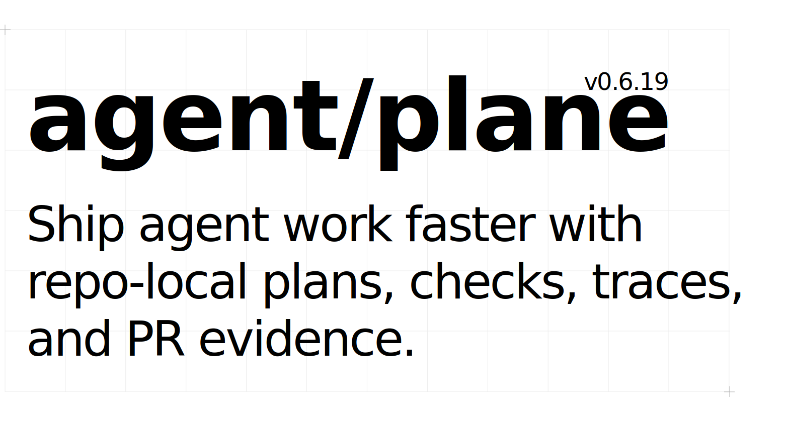

<p align="center">
  
</p>

# JSON Schemas

This directory is the repository discovery catalog for public AgentPlane JSON Schemas.

Generated public schemas are rendered from Zod contracts in `packages/core/src/**` and synchronized by:

```bash
bun run schemas:sync
```

The same generated schemas are mirrored into:

- `packages/spec/schemas/*.schema.json` for tooling and published distribution
- `packages/core/schemas/*.schema.json` for runtime-package consumers
